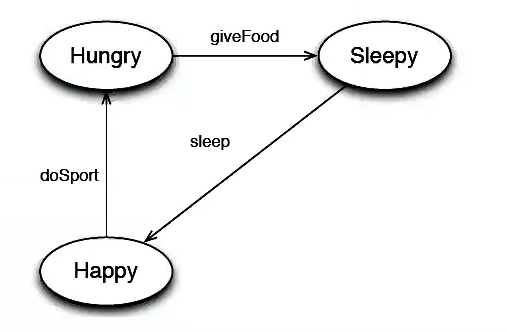

# Tamagotchi

Un tamagotchi es un pequeño animal virtual. Como todo los seres vivos, un tamagotchi tiene necesidades. A continuacion se muetra un pequeño diagrama de estado:



* Comenzamos con el contexto que es el Tamagotchi:
  ```java
  public class Tamagotchi {
    private State state;

    public Tamagotchi() {
      state = new Happy(this);
    }

    public boolean isHappy() {
      return state.isHappy();
    }

    public boolean isHungry() {
      return state.isHungry();
    }

    public void doSport() {
      state.doSport();
    }

    public void giveFood() {
      state.giveFood();
    }

    public void sleep() {
      state.sleep();
    }

    public boolean isSleepy() {
      return state.isSleepy();
    }

    public void setState(State s) {
      state = s;
    }
  }
  ```
  * El objeto se debe pasar a si mismo como parametro al estado `Happy` para que así este estado sepa a que a objeto se hace referencia.

* Estado:

  ```java
  public class State {
    protected Tamagotchi tama;

    public State(Tamagotchi tamagotchi) {
      tama = tamagotchi;
    }

    public boolean isHappy() {return false;}
    public boolean isHungry() {return false;}
    public boolean isSleepy() {return false;}

    public void doSport() {}
    public void giveFood() {}
    public void sleep() {}
  }
  ```
  * Donde los metodos para cambiar de estado se dejaron vacios, es decir, si por ejemplo el tamagotchi está haciendo deporte y cambio de estado es hacer deporte, seguirá haciendo deporte. Esta manera tambien es correcta.

* Estados concretos:

```java
public class Happy extends State {
  public Happy(Tamagotchi tamagotchi) {
    super(tamagotchi);
  }
  public boolean isHappy() {return true;}
  public void doSport() {tama.setState(new Hungry(tama));}
}

public class Hungry extends State {
  public Hungry(Tamagotchi tamagotchi) {
    super(tamagotchi);
  }
  public boolean isHungry() {return true;}
  public void giveFood() {tama.setState(new Sleepy(tama));}
}

public class Sleepy extends State {
  public Sleepy(Tamagotchi tamagotchi) {
    super(tamagotchi);
  }
  public boolean isSleepy() {return true;}
  public void sleep() {tama.setState(new Happy(tama));}
}
```