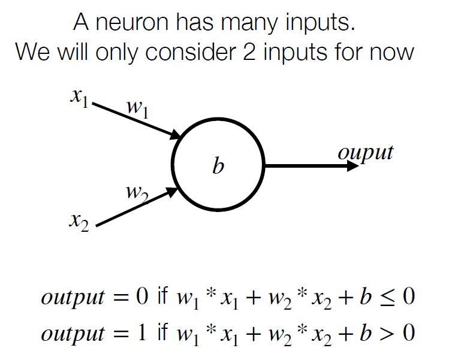
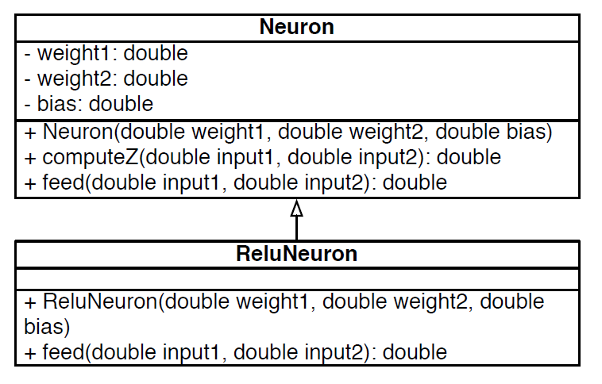

# Java
Algunas caracteristicas de este lenguaje son:
* Java compila a traves de JVM (Java Virtual Machine).
* Para compilar se utiliza el comando: `javac hola.java`

  Esto crea un archivo binario `.bin`
* Para ejecutar se usa: `java hola`

# Hola mundo
Para crear nuestro primer hola mundo, podemos escribir el siguiente codigo:
```java
public class HelloWorld{
  public static void main(String[] args){
    System.out.println("Hellor World");
  }
}
```
Lo que se crea es una clase con el nombre `HelloWorld`, en el cual existe una funcion `main()`, funcion principal que se ejecutara, esta debe poseer siempre la misma platilla (por ahora), es decir:
```java
public static void main(String[] args)
```
* `public`: Indica que la funcion/clase es publica, por tanto, se puede acceder desde otros archivos.
* `static`: Con esto no es necesario declarar un objeto asociado a la clase para llamar a `main()`, es decir, se va a llamar desde afuera del programa.
* `void`: Tipo de dato que retorna la funcion, en este caso no retorna nada.
* `String[] args`: Variable que recibe `main()` como parametro, en este caso es `args` la cual es un arreglo de `String`.

**A la hora de crear la funcion `main()`, esta debe estar en una sola clase, usualmente la clase principal, tambien llamada `main`.**

# Constructor y Metodos para Clases
Para esquematizar el funcionamiento de los metodos en las clases utilizaremos un ejemplo que aplique estos.
## Ejemplo Neurona



Empezaremos por crear una clase llamada `Neuron` y definiremos tres **variables de instancias**: $w_1, w_2, b$. Ademas, tendremos dos metodos para esta clase:
* `computeZ()`: Calcula el valor intermedio de la variable `z`.
* `feed()`: Retorna el valor de salida de la neurona.

```java
public class Neuron{
  private double weight1, weight2, bias;

  public Neuron(double w1, double w2, double b){
    this.weight1 = w1;
    this.weight2 = w2;
    this.bias = b;
  }

  public double computeZ(double input1, double input2){
    return input1*weight1 + input2*weight2 + bias;
  }

  public double feed(double input1, double input2){
    double z = this.computeZ(input1, input2);
    if (z<=0) return 0;
    else return 1;
  }
}
```
* `Neuron()`: **Contructor** asociado a la clase, en base a este constructor se pueden crear objetos de la clase asociada, en este caso `Neuron`, por ejemplo:

  ```java
  Neruon neuron = new Neuron(1.0, 1.0, 1.0);
  ```

  * En el contructor se asignan las variables de instancias, es importante que el nombre de la funcion sea el mismo que el de la clase, pues en caso contrario no compilará. El constructor estará encargado de crear los objetos asociados a la clase, por tanto la funcion no retorna.

  **OBS: Si no se declara el constructor, java automaticamente crea uno que no recibe ningun parametro.**
* Comunmente las **variables de instancias deben ser privadas**, es decir, se debe declarar como `private`, esto implica que solo son conocidas por la clase y sus metodos, donde esto ultimo solo es correcto en caso de que las variables de instancias son asignadas por medio del constructor, en caso contraria, los metodos no las reconocerán.
* Para llamar a otros metodos que se encuentran dentro de la misma clase la manera correcta de declararlos es `this.metodo()`, pues como se verá mas adelante surge un problema en caso de no declararlos así debido a la herencia de clases.
* Tanto metodos como variables pueden ser llamados por instancias de clases a traves de `objeto.metodo()` u `objeto.var` respectivamente y siempre y cuando estos no sean `private`.


Ahora para testear el programa creamos otra clase que se encarge tanto de crear un objeto de la clase `Neruon` como de probar los metodos de esta, es decir, necesitaremos crear una funcion `main()`:

```java
public class NeuronExample{
  public static void main(String[] args){
    Neuron or = new Neuron(1.0, 1.0, -0.5);
    System.out.println("0 OR 0" + or.feed(0,0));
    System.out.println("1 OR 0" + or.feed(1,0));
  }
}
```
* `println()`: Funcion del paquete `System.out` para imprimir en la linea de comandos, convierte cualquie valor a `String` para poder concatenarlo.
* `NeuronExample`: Esta clase le envia ordenes al objeto `or` definidos en terminos de **mensajes**, los cuales deben ser comprendidos por este, es decir, el compilador verificará que los metodos aplicados a este objeto se encuentren en la clase `Neuron` en tiempo de compilacion.

**En el caso de metodos estaticos (`static`), estos no son vistos por la clase, solo son vistos los metodos de instanciacion que no son privados. Por ejemplo, el metodo `main()` es llamado directamente por la JVM sin instanciar un objeto de la clase en donde se encuentre, es decir, se llama `NombreClase.main()`. Por otra parte, si una variable es estatica, implica que el sector de memoria es exactamente el mismo para este y para cualquier variable a la cual se le asigne esta variable estatica.**

# Herencia de Clases y `super()`
Nuevamente para esquematizar la Herencia de Clase se utilizara de ejemplo la clase `Neurona` y otros complementos.

## Ejemplo ReluNeuron
Para este caso crearemos una neurona un poco diferente, el valor de `z` será el mismo, sin embargo, la salida no, es decir, necesitaremos modificar el metodo `feed()`, pero no asi `computeZ()`. 

```java
public class ReluNeuron extends Neuron{
  public ReluNeuron(double w1, double w2, double b){
    super(w1,w2,b);
  }
  
  public double feed(double input1, double input2){
    double z = this.computeZ(input1, input2);
    return (z>0) ? z:0;
  }
}
```
* La clase `ReluNeuron` extiende de la clase `Neuron` para lo cual se declara la clase utilizando `extends`. Por otra parte, se llama al constructor de la clase base a traves de la llamada `super()`, pasando las variables de instanciacion, para inicializar `ReluNeuron`.

  **OBS: Siempre la llamada `super()` será la primera funcion en declararse dentro del constructor cuando se crea una clase que extiende de otra clase.**

* Al llamar al metodo `this.computeZ()` se buscará primero en la subclase `ReluNeuron`, luego al no encontrarse en esta clase, se buscará en la clase padre, es decir, en `Neuron` (todo esto en tiempo de compilacion).

* Como queremos redefinir `feed()`, el metodo debe volver a crearse. Sin embargo, debe tener la misma **firma** que el metodo de la clase de la cual hereda, es decir, debe retornar el mismo tipo y recibir los mismos parametros.

# Esquema de Herencia de Clases UML (Unified Modeling Languaje)
En casos donde exista herencia de clases, siempre es util crear un diagrama con las respectivas indicaciones de herencia y los metodos que cada clase u subclase posee.



* La flecha con fondo blanco indica que la subclase `ReluNeuron` hereda de la clase padre `Neuron`.
* Los simbolos $+$ indican que los parametros son publicos (`public`), los simbolos $-$ indica que los parametros son privados (`private`).
* Los metodos de la clase superior son heredados hacia las subclases.
* Aunque las variables de instancias de la clase `Neuron` son privadas, estas pueden ser inicializadas a traves del constructor en la subclase `ReluNeuron` por medio de la llamada a `super()`.

# Observaciones con respecto a Herencia de Clases y creacion de objetos (Polimorfismo)

Supongamos se crean los siguientes objetos, declarandose de la siguiente manera:

```java
Neuron n = new Neuron(1,1,-0.5);
n.feed(1,1);
```

* Lo que se crea es un objeto de tipo `Neuron`, donde al llamar al metodo `feed()`, este metodo es el asociado a la clase `Neuron`, es decir, se ejecuta `Neuron.feed()`.

```java
ReluNeuron n = new ReluNeuron(1,1,-0.5);
n.feed(1,1);
```

* Lo que se crea es un ojeto de tipo `ReluNeuron`, que al llamar al metodo `feed()`, este metodo es el asociado a la subclase `ReluNeuron`. Se ejecuta `ReluNeuron.feed()`.

```java
Neuron n = new ReluNeuron(1,1,-0.5);
n.computeZ(1,1);
```

* **En tiempo de compilacion**, los metodos que son chequeados por el compilador, son los metodos del tipo de la variable `n`, es decir, de la clase `Neuron`.
* **En tiempo de ejecucion**, `n` se comportará como un objeto de tipo `ReluNeuron` que al llamar al metodo `computeZ()`, lo buscará en esta subclase, sin embargo como no existe, seguirá la busqueda en la clase padre, es decir, en `Neuron`. Se ejecuta `Neuron.computeZ()`.

**OBS:** A parte, el compilador chequea si la clase es subclase (o subclase de una subclase ...) de la clase `Neuron`, pues en caso contrario no se podran utilizar los metodos heredados.

```java
Neuron n = new ReluNeuron(1,1,-0.5);
n.feed(1,1);
```
* **En tiempo de compilacion**, el compilador chequea que en `Neuron` exista el metodo `feed()`. Ademas, ve si la clase `ReluNeuron` es subclase de `Neuron`.
* **En tiempo de ejecucion**, buscara el metodo en la clase `ReluNeuron` y como este existe se ejecuta `ReluNeuron.feed()`.

# Terminologia

# Objeto
Un **objeto** comprende los mensajes heredados y definidos de su clase. Tambien se puede ver como una coleccion de datos que tiene cierta relacion.
  * Dos objetos pueden tener la misma informacion, atributos, sin embargo no por eso son iguales, solo en caso de que se alojen en el mismo sector de memoria se dirá que son iguales.

# Clase

Una **clase** en principio se puede observar como una fabrica de objetos. Esta definido como un conjunto de declaraciones de variables y definiciones de metodos: `class = name + variables + methods + superclass`

**OBS:** En java: `class = name + variables + methods + superclass + interfaces + static methods + ...`

# Metodo 

Un **metodo** es un pedazo de codigo ejecutable, este termina cuando:
  * No existen mas instrucciones a ejecutar.
  * Se alcanza la declaracion `return`
  * Se alcanza una excepcion.

Se pueden acceder a las **pseudo-variables** `this` y `super()` (solo en un metodo de instancia, no en metodos estaticos).

# Herencia/Subclase

Este procedimiento se utiliza cuando se requiere de la especializacion entre clases. Una subclase **hereda atributos** y **comportamientos** de la superclase.

**OBS: Esta considerado un mal diseño de programacion utilizar herencia para reutilizar codigo.**

# Polimorfismo

Es la habilidad de que un tipo A parezca y sea usado como otro de tipo B. El **polimorfismo** juega un rol importante entre el envio de mensajes e invocaciones de funciones, ej:

```java
Neuron n = new ReluNeuron(1,1,-0.5);
```

# Polimorfismo Parametrico

Permite que una funcion o tipo de dato pueda ser escrito de manera generica, para asi poder manipular valores de manera uniforme sin depender de su tipo, ej:

```java
ArrayList<Double> list = new ArrayList<Double>();
list.add(1.0);
list.add(2.0);
```

**OBS:** Java soporta solo una versin debil del polimorfismo parametrico.