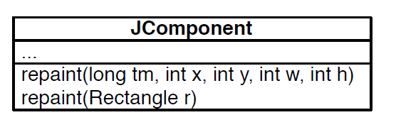
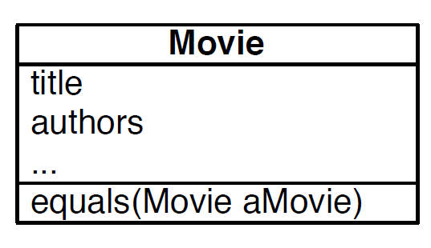

# Ejemplo Point y Setter, Getters and ToString

Supoongamos queremos modelar un punto de dos dimensiones, para este caso necesitaremos crear una clase `Point` con dos variables de instancias:

```java
package cc3002.Point;

/**
 * Model a 2D point
 */
public class Point {

  private double x;
  private double y;

  public Point(double x, double y) {
    this.x = x;
    this.y = y;
  }

  public Point() {
    this.x = 0;
    this.y = 0;
  }

  public Point(Point anotherPoint) {
    this.x = anotherPoint.x;
    this.y = anotherPoint.y;
  }

  public Point add(Point anotherPoint) {
    return new Point(this.getX()+ anotherPoint.getX(), this.getY() + anotherPoint.getY());
  }

  public Point sub(Point anotherPoint) {
    return new Point(this.getX() + anotherPoint.getX(), this.getY() + anotherPoint.getY());
  }
  public double getX() {
    return x;
  }

  public double getY() {
    return y;
  }

  @Override
  public String toString() {
    return "(" + "x=" + x + ", y=" + y +')';
  }
}
```

El cual podemos testear su correctitud creando una clase `PointExample`:

```java
package cc3002.Point;

public class PointExample {
  public static void main(String[] args) {
    Point p1 = new Point(3, 4);
    Point p2 = new Point(-4, 7);
    Point p3 = new Point();

    System.out.println("Value of p1 = " + p1.toString());
    System.out.println("Value of p1 + p2 = " + p1.add(p2).toString());
  }
}
```

* Como se observa todos los codigos (clases) se encuentran dentro de un mismo paquete llamado `cc3002.Point`, con el cual cada clase puede acceder a los demas archivos, siempre y cuando estos sean publicos.
* `setX() setY()`: Funciones para obtener el valor guardado en la variable de instanciacion, pues estas variables son privadas, por lo que no se puede acceder a ellas mediante `objeto.x` u `objeto.y`.
* `toString()`: Funcion para representar la informacion del objeto de manera esquematica.

# Constructor de una clase

**Un constructor es el responsable de inicializar correctamente un objeto.**

En el ejemplo anterior, a la hora de declarar `new Point()` en un `main()`, se aloja un sector de memoria en donde se guarda el objeto creado y este nuevo objeto es inicializado.

* Tener un constructor no significa que el objeto estará bien inicializado.

En Java si no se crea el constructor de la respectiva clase, se crea uno por default que no recibe parametros. Por otra parte, a la hora de declarar el constructor este constructor por default deja de existir y por tanto a la hora de crear un objeto con el constructor sin parametros, este lanzará un error en tiempo de compilacion.


# Sobreescribir metodos (Method Overriding)

**Un overrinding de metodos es una instancia de un metodo en una subclase tal que posee la misma firma que posee este metodo en la superclase pero que sobreescribe este ultimo.**

Que posea la misma firma implica que el metodo posee el mismo nombre, numero y tipos de los parametros.

* **Method signature:** name + number of parameters + type of its parameters
* **En Java el tipo del valor retornado del metodo puede ser un una subclase de la clase base**. Ejemplo:

```java
public class ColorPoint extends Point{
  ColorPoint add(Point anotherPoint);
}
```

**OBS:** Al hacer un override de 'equals()' podemos observar este caso, pues cambia el tipo del parametro que recibe, a la clase en la cual se sobreescribe, sin embargo hay que recordar que todas las clases heredan de la clase 'Object' en Java.

* **En base a la firma se busca al metodo que se debe llamar en una jerarquia de clases.**

# Sobrecarga de metodos (Method Overloading)

Un **method overloading** ocurre cuando dos metodos definidos en una jerarquia tienen el mismo nombre pero diferentes firmas.



**OBS: Esto puede generar bugs debido a la confusion a la hora de ocupar el metodo.**

# Clase Object

En Java todo objeto hereda de la clase `Object` de manera implicita. Esta clase permite que las Java Collections (ArrayList, Vector, etc) puedan contener instancias de cualquier clase definida por uno. Es muy comun querer comparar elementos almacenados y para eso la clase `Object` provee el metodo boleano `boolean equals(Object)` para que se pueda hacer **overrinding** por las subclases. Este metodo por defecto retorna `false`.

## Ejemplo uso `equals()` (no correcta)

Supongamos tenemos la siguiente clase que sobreescribe el metodo `equals()`, para determinar si dos peliculas son iguales o no:

```java
@Overloading
public boolean equals(Movie aMovie){
  return aMovie.title.equals(this.title) && aMovie.authors.equals(this.authors);
}
```


Luego podemos testear este metodo con los siguientes casos:

```java
String t = "The Godfather";
String a = "Coppola";

Movie m1 = new Movie(t,a);
Movie m2 = new Movie(t,a);

m1.equals(m2);
```
* `equals()` retorna `true` pues ambas peliculas poseen el mismo titulo y autores.

```java
String t = "The Godfather";
String a = "Coppola";

Object m1 = new Movie(t,a);
Movie m2 = new Movie(t,a);

m1.equals(m2);
```
* `equals()` retorna `false` pues el metodo llamado por `m1` es el que posee la clase `Object`, pues es de tipo `Object`,  y no el overloading de la clase `Movie`.

```java
String t = "The Godfather";
String a = "Coppola";

Movie m1 = new Movie(t,a);
Object m2 = new Movie(t,a);

m1.equals(m2);
```
* `equals()` retorna `false` pues aun cuando `m1` esta llamando a `equals()`, el metodo posee de parametro un objeto de tipo `Object`, por tanto se buscará el metodo que posea la firma correspondiente, en este caso el de la clase `Object` (`equals (Object anObject)`).

## Version correcta de la implementacion de `equals()`

La implementacion de `equals()` vista anteriormente no es totalmente correcta, pues como se observa realiza un overloading generando uso de `equals()` distintos dependiendo de la firma del metodo utilizado, es por esto que una mejor implementacion es la siguiente:

```java
public class Movie{
  private String title;
  private String author;

  public Movie(String title, String author) {
    this.title = title;
    this.author = author;
  }

  @Override
  public boolean equals(Object o) {
    if (o instanceof Movie) {
      return ((Movie) o).title.equals(this.title) && 
             ((Movie) o).author.equals(this.author);
    }
    return false;
  }
}
```

* Solo es bien visto y correcto preguntar si un objeto es de una clase en especifico, dentro de dicha clase.
* Como se observa, debido a que el metodo `equals()` implementado es un override del metodo de la superclase `Object` se debe realizar un **casting** de este objeto para poder obtener las variables de instancia que posee el objeto de clase `Movie`, en caso de ser una instancia de esta. 
* `obj instanceof class`: Operador para comparar si un objeto `obj` es de la clase `class`, retorna `true` si lo es y `false` en caso contrario.

**Se considera un buen diseño de programacion indicar al inicio de un metodo si este es un override u overload**