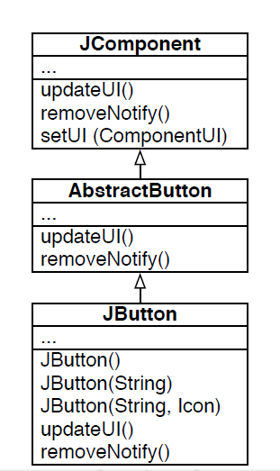

# Ejemplo Herencia en libreria JDK

Consideremos la libreria JDK de Java que posee el siguiente diagrama UML:



* Se generó una jerarquia de clases donde toda subclase hereda de la clase padre `JComponent`.
* `AbstractButton`: Clase abstracta que contiene todos los aspectos que son comunes a todos los botones.
* `JButton`: Clase para crear un boton que posee 3 constructores. Cada uno de estos constructores esta definido de la siguiente forma:

  ```java
  public JButton() {
    this(null, null);
  }
  
  public JButton(String text) {
    this(text, null);
  }

  public JButton(String text, Icon icon) {
    // super();  // Implicito

    // Create the model
    setModel(new DeaultButtonModel());

    // Initialize
    init(text, icon);
  }
  ```

  * Donde la keyword `this` es usada para invocar el constructor de esa misma clase.
  * Para el caso de `JButton(String text, Icon icon)`, la llamada a `super()` es implicita, se puede declarar de igual manera, pues se deben inicializar las variables de instancias de las clases padres de toda forma en caso de ocuparse.

* La clase `AbstractButton` es una clase abstracta donde cada subclase la especializará, por tanto no se puede inicializar un objeto de esta clase, en caso contrario el compilador reclamará

# Clases Abstractas

**Una clase abstracta es un clase incompleta, que no puede ser instanciada, es decir no puede inicializarse un objeto de esta clase, en caso contrario el compilador reclamará**

* Tiene que ser declarada con la keyword `abstract` y puede contener metodos abstractos que deben ser declarados y pueden o no estar implementadosen esta clase. En caso de no querer implementar el metodo y solamente declararlo se debe anteponer la keyword `abstract`, ej:
  ```java
  public abstract String type();
  ```

* Puede contener variables de instancias asi como un constructor.
* Es posible crear un objeto de la siguiente manera, pero no es una buena practica:
  
  ```java
  AbstractButton button = new JButton();
  ```