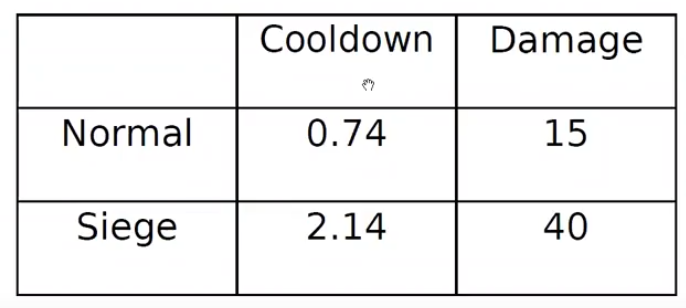

# Ejemplo: Warcraft

Consideremos el juego Warcraft donde se tienen dos tipos de tanques con las siguientes caracteristicas:



* La mejor idea es modelar dos tanques como la subespecializacion de un tanque generico, es decir, creamos una clase abstracta `AbstractTank` que provee el codigo comun a todos los tanques. Por otra parte, crearemos las subclases para cada tanque, `NormalTank` y `SiegeTank`.
* De esta forma es posible extender el codigo en caso de que en el futuro se agregue un nuevo tanque.

Posible solucion:

```java
public class StartcraftExample {
  public static void main(String[] args) {
    NormalTank tank1 = new NormalTank();
    SiegeTank tank2 = new SiegeTank();
    tank1.print();
    tank2.print();
  }
}
```

Donde las clases se definen como:
```java
public abstract class AbstractTank {
  public abstract String type();
  public abstract double cooldown();
  public abstract int damage();
  public void print() {
    System.out.println(this.type() + "(" + this.cooldown() + "," + this.damage() + ")");
  }
}

public class NormalTank extends AbstractTank{
  @Override
  public String type() {
    return "NormalTank";
  }

  @Override
  public double cooldown() {
    return 0.74;
  }

  @Override
  public int damage() {
    return 15;
  }
}

public class SiegeTank extends AbstractTank{
  @Override
  public String type() {
    return "SiegeTank";
  }

  @Override
  public double cooldown() {
    return 2.14;
  }

  @Override
  public int damage() {
    return 40;
  }
}
```

* `print()`: Esta funcion se declara e implementa en la clase abstracta `AbstractTank` pues es comun a las dos clases hijas, ademas se observa que la variable `this` que contiene hace referencia al tipo del objeto creado.