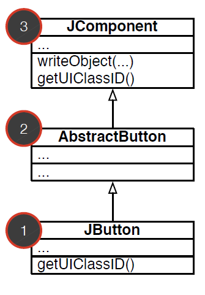

# Pseudo variables: `this` y `super()`

* **La pseudo variable `this` se refiere al objeto que se creó como instancia.**
* **La pseudo variable `super` se refiere al objeto que se creó como instancia**. Su accion es mirar hacia la clase padre de la subclase. Un mensaje enviado a `super` comienza la busqueda en la superclase de la clase en la cual se realizó la llamada.

# Principio de Herencia de Clases

**Enviar un mensaje a un objeto acciona una busqueda a traves de la jerarquia de clases, desde la clase del objeto instanciado.**

* La busqueda de un metodo parte en la clase del objeto, ascendiendo en la jerarquia para encontrar este metodo.

**OBS:** Este metodo existira, pues en tiempo de compilacion se verificará que exista el metodo para la clase de la variable asignada (notar que esto es diferente a la clase del objeto instanciado).

## Ejemplo polimorfismo

Veamos la siguiente jerarquia de clases



Si se ejecuta la siguiente linea de codigo:
```java
JButton button = new JButton("OK");
button.writeObject(stream);
```
* Como la clase `JButton` no posee el metodo `writeObject()`, este se buscará en la clase padre hacia arriba, en este caso el metodo se encuentra en la clase `JComponent` donde se implementa de la siguiente manera:

  ```java
  // Clase JComponent

  public void writeObject(ObjectOutputStream s) throws IOException {
    s.defaultWriteObject();
    if (getUIClassID().equals(uiClassID)) {
      ...
    }
  }
  ```

Donde en la condicion, se llama al metodo `getUIClassID()`, este metodo hace referencia al metodo de la clase de la instancia del objeto creado, por tanto se refiere al metodo de la clase `JButton`. Adicionalmente, es una buena practica de diseño añadir en este caso la seudo variable `this` a este metodo en la clase `JComponent` aun cuando Java lo realiza automaticamente.

  ```java
  // Clase JComponent

  public void writeObject(ObjectOutputStream s) throws IOException {
    s.defaultWriteObject();
    if (this.getUIClassID().equals(uiClassID)) {
      ...
    }
  }
  ```

## Ejemplo triquiñuelo

Veamos el siguiente codigo:
```java
public class A {
  boolean test() {
    return super.getClass() == this.getClass();
  }
}

class B extends A {
  public static void main(String[] argv) {
    System.out.println(new B().test());
  }
}
```
* El resultado de `new B().test()` es `true`, pues de las definiciones de las seudovariables tanto `super` como `this` se refieren al mismo objeto que se creó como instancia, `super` solamente busca en la clase padre considerando que el objeto es de la clase `B`. Se puede ver de la siguiente manera: `this.getClass()` hace referencia al propio objeto y busca en esta el metodo `getClass()`, pero como no existe en esta clase, sube en la jerarquia hasta encontrarlo, en este caso en la clase `Object()`, pero se sigue aplicando al objeto de clase `B`. Por otra parte, `super.getClass()` realiza la busqueda del metodo en la clase superior directamente, luego el argumento siguiente es el mismo.

# Interfaces de Java

**Una interfaz es un grupo de metodos relacionados y que definen un tipo abstracto.**

* Los metodos declarados en la interfaz deben ser obligatoriamente implementados en la clase en la cual se implemente la interfaz a traves de la keyword `implements`.
* En caso de declarar una variable de tipo interfaz, esta variable debe instanciar un objeto de alguna clase que implemente dicha interfaz, sin embargo no es un buen diseño de programacion realizar este tipo de practicas.
* Una clase puede implementar mas de una interfaz.
* Comunmente las clases abstractas implementan interfaces, aun asi las clases comunes tambien pueden.
* **Implementar una interfaz define de manera formal el comportamiento que debe cumplir una clase.**
* **Regla simple: Cuando se necesita más de un tipo de objeto para manejarlo en el contexto de una misma variable, entonces es necesario utilizar interfaces.**
* Una interfaz puede tener cero o mas super interfaces:
  ```java
  interface LotsOfColors extends RainbowColors, PrintColors {...}
  ```
  **OBS:** En la practica suele ocurrir que las clases abstractas implementan las interfaces.


Ejemplo:

```java
interface Readable {
  public int read();
}

class Stream implements Readable {
  public int read() {
    ...
  }
}
```

Con esto uno puede instanciar objetos de la siguiente manera:

```java
Stream r1 = new Stream();
Readable r2 = new Stream();
```
* En el caso de instanciar una variable de tipo `Readable`, esta variable debe contener un objeto de alguna clase que implemente la interfaz.