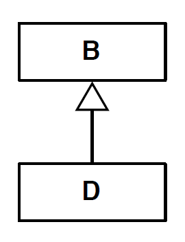
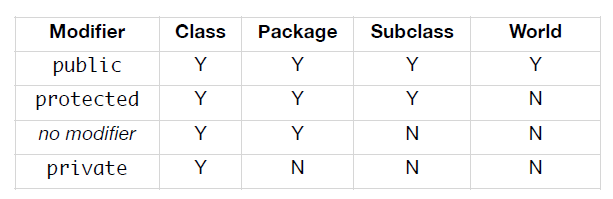
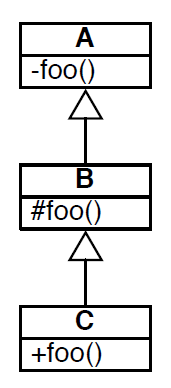

# Principio de Liskov

* **Principio de substitucion: Sea $q(x)$ una propiedad demostrable para un cierto objeto $x$ de tipo $T$. Entonces, $q(y)$ deberia ser cierta para todos los objetos $y$ de tipo $S$, donde $S$ es un subtipo de $T$.**
* **Principio de manera simple: Subtipos deben ser sustituibles por sus tipos bases.**
  * Ejemplo:
  
    ```java
    void f(B object) {
      ...
    }
    ```
  * Si `f(new B())` se comporta correctamente, entonces `f(new D())` tambien debe comportarse correctamente.

* Este principio debe guiar el diseño de clases.

Jerarquia de clases utilizada:



# Clases Fragiles

Siguiendo con el ejemplo anterior:

* Si `f(new B())` se comporta correctamente y `f(new D())` no se comporta correctamente, entonces se dice que **`D` es fragil en presencia de `f()`.**

# Ejemplo para entender el Principio de Liskov

Supongamos se tiene el siguiente codigo implementado para la funcion:

```java
public static long sumShapes(Shape[] shapes) {
  long sum = 0;
  for (int i=0; i<shapes.lenght; i++) {
    if (shapes[i] instanceof Rectangle) {
      Rectangle r = (Rectangle) shapes[i];
      sum += (r.width * r.height);
      break;
    }
    if (shapes[i] instanceof Circle) {
      Circle r = (Circle) shapes[i];
      sum += (Math.PI * r.radius * r.radius);
      break;
    }
    // more cases
  }
  return sum;
}
```

* Como se observa para cada subclase de `Shape` se debe realizar la suma del area de una forma determinada, lo cual es ineficiente si en un futuro se implementan nuevas figuras, por ejemplo una linea o un poligono, por tanto este codigo no obedece el principio de Liskov, pues se puede implementar un metodo `area()` en shape que calcule el area el cual, por este principio, debe funcionar correctamente para subclases de esta.

# Privilegios de acceso

Los privilegios de acceso aplican tanto a definiciones de clases como a miembros de esta, por ejemplo: campos, metodos, clases interiores.



* Los privilegios se deben dar de acuerdo al criterio de uso de metodos y clases, en caso de ser necesario que uno de estas sea ocupado por otra clase o metodo de otra clase sera necesario ponerlo publico. En general, las variables de instancias de una clase se deben declarar como privadas y en caso de querer acceder a ellas ocupar metodos como setters y getters.

## Ejemplo Jerarquia de clases

Supongamos tenemos la siguiente jerarquia de clases:



```java
class A {
  private void foo() {

  }
}

class B extends A {
  protected void foo() {

  }
}

class C extends B {
  public void foo() {

  }
}
```

* En este caso no se viola el principio de Liskov pues los subtipos son especializaciones del tipo base. En el caso contrario en que los privilegios estuviesen al revés, es decir, `foo()` de la clase `A` sea `public` y `foo()` de la clase `C` sea `private`, se violaria este principio pues no existiria subespecializacion.

# Observacion respecto a overriding de metodos

Posible redifinicion (sobreescritura de metodos) en teoria:

* **No hay redifinicion**: misma firma.
* **Redifinicion arbitraria**: solo exige conservacion del nombre del metodo.
* **Redefinicion restringida**: relacion de **subtipos** entre firmas de los metodos.
  * Cuando T1 -> T2 es subtipo de T3 -> T4 ?
    * Relacionar a: `T2 f(T1)` es subtipo de `T4 f(T3)`, es decir, `T1` es subclase de `T3` y `T2` subclase de `T4`.

## Cuando un metodo es subtipo de otro?

Notacion: **nombre: tipos de los argumentos -> tipo del resultado**