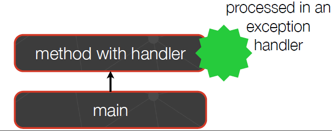
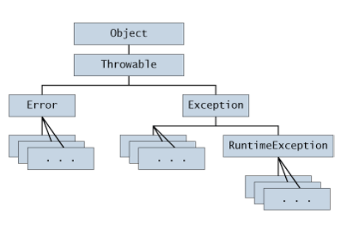

# Excepciones

El lenguaje Java utiliza excepciones para manejar errores y eventos producidos por un mal uso del codigo del programa o por el uso de algo que no existe.

Esquema de excepciones para leer un archivo:

```java
readFile {
  try {
    open the file;
    determine its size;
    allocate that much memory;
    read the file into memory;
    close the file;
  } catch (fileOpenFailed) {
    doSomething;
  } catch (sizeDeterminationFailed) {
    doSomething;
  } catch(memoryAllocationFailed) {
    doSomething;
  } catch (readFailed) {
    doSomething;
  } catch (fileCloseFailed) {
    doSomething;
  }
}
```
* El objetivo es atrapar el error que se produce de manera que el usuario que interactua con el programa no lo vea y este se ejecute correctamente, avisando que algun evento, como por ejemplo que no hay suficiente memoria, ocurrió.

# Que es una excepcion?

Cuando un error ocurre en un cierto metodo, el metodo crea un objeto y lo maneja el sistema en tiempo de ejecucion.

**Una excepcion es un evento que ocurre durante la ejecucion de un programa que interrumpe el flujo normal de las instrucciones de este.**

Crear un **exception object** y manejarlo en el sistema se denomina **lanzar una excepcion (throwing an exception).**

## Creando un archivo con un path vacio

```java
package java.io;

public class File implements Serializable, Comparable<File> {
public File(String pathname) {

  if (pathname == null) {
  throw new NullPointerException();
  }
  this.path = fs.normalize(pathname);
  this.prefixLength = fs.prefixLength(this.path);
  }
  ...
}
```

* En caso de que `pathname` sea nulo se lanza una excepcion que indica que el puntero dado es nulo.

# Definiendo clases de excepciones

En Java todas las excepciones heredan de la clase `RunTimeException`, en caso de querer crear una nueva excepcion, esta deberá heredar de `RunTimeException`

```java
package java.lang;

public class NullPointerException extends RuntimeException {
...
}
```

# Quien maneja la excepcion?

Luego de que un metodo lanza una excepcion, el sistema en tiempo de ejecucion intenta encontrar a alguien que maneje esa excepcion.

El conjunto de los posibles "algos" que puedan manejar la excepcion es una lista ordenada de metodos que han sido llamados hasta obtener el metodo donde ocurrió el error.

Esta lista de metodos se conoce como **La llamada a la pila (The call Stack)**.

# Buscando en la Call Stack

El sistema busca, en tiempo de ejecucion, en el **call stack** por un metodo que contenga un bloque de codigo que pueda manejar la excepcion.



* El bloque de codigo que maneja la excepcion se denomina **Exception Handler**.
* El codigo retorna en el sector del stack que posee al metodo que maneja la excepcion.
* La busqueda comieza con el metodo en el cual el error ocurrió para luego avanzar en orden inverso por la **call  stack**.
* El metodo elegido para manejar la excepcion se dice que **atrapó la excepcion (catch the exception)**.

**OBS: En caso de no existir un metodo que maneje la excepcion, el programa imprime la llamada a la pila y finaliza.**

# The Catch or Specify Requirement

En Java el codigo programado debe regirse por esta metodologia. 

Esto significa que el codigo que posiblemente lanze una excepcion debe estar encasillado por:

* Un bloque de codigo `try` que atrape la excepcion. Este debe proveer bloques que manejen las excepciones.
* Metodos que lanzen las excepciones. El metodo debe proveer una sentencia que lanze la lista de excepciones.

## Keyword `throws`

```java
package java.io;

public abstract class OutputStream implements Closeable, Flushable {
...
  public void write(byte b[]) throws IOException {
    write(b, 0, b.length);
  }
  public void write(byte[] b, int off, int len) throws IOException {
  ... throw new IOException() ...
  }
}
```

# Los tres tipos de excepciones

## Excepciones de Chequeo (Checked exception)

**Condiciones excepcionales que una aplicacion bien escrita debería anticipar y recuperarse de estas.**

* Todas las excepciones son del tipo **Checked exceptions**, excepto por aquellas indicadas por **Error** y **RunTimeException** y sus subclases.
* **Es necesario especificar la excepcion en una sentencia `throws`, cuando se define el metodo que puede lanzarla.**

## Errores (Error)

**Este tipo de excepciones son externas a la aplicacion**

* Usualmente la aplicacion no puede anticipar o recuperarse de esta, por ejemplo un mal funcionamiento del hardware o sistema, `java.lang.IOError`.
* **Los errores no estan sujetos a Catch or Specify Requirement**.
* No es necesario especificar la excepcion cuando se define un metodo.
* Las clases que modelan los errores son subclases de `java.lang.Error`.

## Excepciones en tiempo de ejecucion

**Excepciones que son internas a la aplicacion y de las cuales la aplicacion no puede recuperarse o anticiparlas. Por ejemplo, bugs, errores logicos, un mal uso de una API, NullPointerException.**

* La aplicacion puede atrapar este tipo de excepciones, pero hace mas sentido eliminar el bug que causa que la excepcion ocurra.
* **Las excepciones en tiempo de ejecucion no estan sujetas a CAtch or Specify Requirement**.
* Runtime exceptions son aquellas indicadas por `RuntimeException` y sus subclases.

**OBS: Errores y Runtime exceptions son conocidas como excepciones no chequeadas.**

# Que tipo de excepcion deberiamos usar?

* En caso de utilizar excepciones de chequeo, lo usual es crear una subclase de `java.lang.Exception` y utilizar `throws`, `try` y `catch`, para lanzar la excepcion y y agregar un apropiado manejo de esta en caso de que el procedimiento de ejecucion del programa no siga lo esperado.

* A excepcion de algun caso especial, se puede definir un handler, o manje de excepcion, para algun error, es decir, una subclase de `Error`. Por ejemplo, en caso de que la aplicacion consuma demasiada memoria, avisarle al usuario que no hay mas memoria libre.

**OBS: Es muy probable que no sea necesario crar una subclase de `Error` o `RuntimeError`.**

# Lanzando una excepcion

Lanzar un objeto se realiza mediante la keyword `throw`:

```java
throw object
```

* Doonde `object` es un objeto que pose el tipo lanzable (`throwable`).

# Atrapando mas de una excepcion

Es posible agregar mas `catch` al bloque que se encarga de atrapar la excepcion.

```java
try{
  ...
} catch(ExceptionType1 name) {
  ...
} catch (ExceptionType2 name) {
  ...
}
```
* **Las sentencias de `catch` deben ir en orden. El primer handler que coincida con la clase de la excepcion es el que se utiliza.**

## Ejemplo

```java
class Example {
  static class E extends Exception {}
  static class E2 extends E {}
  static void foo() throws E{
    throw new E(); // Debe coincidir con el tipo de throws E
  }
  public static void main(String[] argv) {
    try {
      foo();
    }
    catch(E2 e){System.out.println("Handler E2");}
    catch(E e){Sysyem.out.println("Handler E");}
  }
}
```

* En este caso la ejecucion imprime "Handler E" pues `foo()` lanza una instancia de tipo `E`.
* Es importante que el objeto que lanza el metodo `foo()` coincida con el tipo de objeto que se definió que iba a lanzar este.

## Ejemplo que no compila

```java
class Example {
  static class E extends Exception {}
  static class E2 extends E {}
  static void foo() throws E{
    throw new E(); // Debe coincidir con el tipo de throws E
  }
  public static void main(String[] argv) {
    try {
      foo();
    }
    catch(E e){System.out.println("Handler E");}
    catch(E2 e){Sysyem.out.println("Handler E2");}
  }
}
```
* `E` es atrapado antes que `E2`. Este codigo no compila pues el `catch(E2)` nunca será alcanzado debido a que `E` es un supertipo de `E2`.

## Ejemplo tipo dinamico de excepcion

```java
class Example {
  static class E extends Exception {}
  static class E2 extends E {}
  static void foo() throws E{
    throw new E2(); // Debe coincidir con el tipo de throws E
  }
  public static void main(String[] argv) {
    try {
      foo();
    }
    catch(E2 e){System.out.println("Handler E2");}
    catch(E e){Sysyem.out.println("Handler E");}
  }
}
```

* La ejecucion imprime "Handler E2" porque `foo()` lanza una instancia de `E2`, independientemente de que se haya declarado `throws E`.

## `throws` y `try`/`catch` combinados

```java
class Ex1 extends Exception {}
class Ex2 extends Exception {}
class Example3 {
  static void foo() throws Ex1 { throw new Ex1();}
  static void bar() throws Ex2 { throw new Ex2();}

  static void zork() throws Ex2 {
    try {
      foo();
      bar();
    }
    catch(Ex1 e) {}
  }
}
```
* Solo es atrapada la excepcion de instancia `Ex1` mientras que en caso de obtener una excepcion de instancia `Ex2`, esta es lanzada nuevamente por `zork()` y será manejada por el metodo que llame a esta funcion.

```java
class Ex1 extends Exception {}
class Ex2 extends Exception {}
class Example3 {
  static void foo() throws Ex1 { throw new Ex1();}
  static void bar() throws Ex2 { throw new Ex2();}

  static void zork() throws Ex2, Ex1 {
    try {
      foo();
      bar();
    }
    catch(Ex1 e) {throw e;}
  }
}
```
* En este caso `zork()` puede lanzar ya sea una excepcion de tipo `Ex1` asi como de `Ex2`.

# Bloque `finally`

El bloque `finally` **siempre** se ejecuta cuando se ejecuta todo el bloque `try`.

Es una buena practica poner codigo de limpieza dentro de los bloques `finally`, incluso cuando no existan excepciones anticipadas. Por ejemplo, en C, en esta parte se deberia incluir la eliminacion de la memoria pedida utilizando `free()`.

```java
try {
  ...
}
catch (ExceptionType1 name) {}
catch (ExceptionType2 name) {}
finally {
  // cleaning code here
}
```

* El bloque `finally` es utilizado para prevenir fugas de recursos.

## Ejemplo

```java
class Example2 {
  static int foo() {
    try {
      return 5;
    }
    finally {
      return 10;
    }
  }
  public static void main(String[] argv) {
    System.out.println(foo());
  }
}
```

* El valor retornado por `foo()` será 10 pues como se mencionó, el bloque `finally` siempre es ejecutado.

# Especificando las excepciones lanzadas por un metodo

Es apropiado atrapar las excepciones tempranamente.

Algunas veces, sin embargo, es mejor dejar a un metodo por encima de la call stack que se encargue de manejar la excepcion.



* El nodo hijo izquierdo de la clase `Exception` es usualmente el lugar en donde irán las subclases de excepciones que creamos.

# Operaciones sobre una excepcion

Estas operaciones son definidas en la clase `Throwable`. En Java, las excepciones solo pueden ser lanzadas, atrapadas y re-lanzadas nuevamente.


# Creando un archivo con path vacio

```java
package java.io;

public class File implements Serializable, Comparable<File> {

  public File(String pathname) {
    if (pathname == null) {
      throw new NullPointerException();
    }
    this.path = fs.normalize(pathname);
    this.prefixLength = fs.prefixLength(this.path);
  }
  ...
}
```

# Excepciones para abortar recursion

Veamos el siguiente codigo que busca un valor en una matriz de tres dimensiones:

```java
public class Matrix3D {
  private int[][][] table;

  Matrix3D() {
    int[] line0 = { 0, 0, 0 };
    int[] line1 = { 1, 0, 0 };
    int[][] mat1 = new int[][] { line0, line0, line0 };
    int[][] mat2 = new int[][] { line1, line0, line0 };
    int[][] mat3 = new int[][] { line0, line1, line0 };
    table = new int[][][] { mat1, mat2, mat3 };
  }
  …
  public static void main(String[] argv) {
    Matrix3D m = new Matrix3D();
    System.out.println(m.numberOf2DMatricesWith(1));
  }
  int numberOf2DMatricesWith(int v) {
    int nbOfMatching = 0;
    for (int z = 0; z < table.length; z++) {
      boolean doesContain = false;
      
      for (int y = 0; y < table.length; y++) {
        for (int x = 0; x < table[y].length; x++) {
          if (table[z][y][x] == v)
            doesContain = true;
        }
      }
      if (doesContain)
        nbOfMatching++;
    }
    return nbOfMatching;
  }
}
```

* Con este programa debemos evaluar la condicion cada vez que el booleano `doesContain` es verdadero, lo cual implica un mayor tiempo de ejecucion.

```java
int numberOf2DMatricesWith(int v) {
  int nbOfMatching = 0;
  for (int z = 0; z < table.length; z++) {
    try {
      for (int y = 0; y < table.length; y++) {
        for (int x = 0; x < table[y].length; x++) {
          if (table[z][y][x] == v)
            throw new Throwable();
          }
      }
    } catch (Throwable e) {
      nbOfMatching++;
    }
  }
  return nbOfMatching;
}
```

* En este caso al lanzarse la excepcion, no se realizan iteraciones innecesarias.