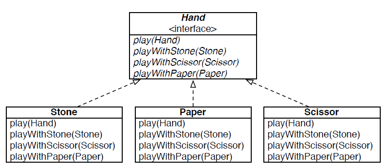

# Diseño 



# Implementacion

```java
interface Hand {
  // 1 win, 0 draw, -1 loose
  int play(Hand v);
  int playWithStone(Stone stone);
  int playWithPaper(Paper paper);
  int playWithScissor(Scissor scissor);
}
```

```java
class Stone implements Hand {
  @Override
  public int play(Hand v) {
    return v.playWithStone (this);
  }@Override
  public int playWithStone (Stone v) {
    return 0;
  }
  @Override
  public int playWithScissor (Scissor v) {
    return -1;
  }
  @Override
  public int playWithPaper (Paper v) {
    return 1;
  }
}
```

```java
class Paper implements Hand {
  @Override
  public int play(Hand v) {
    return v.playWithPaper (this);
  }
  @Override
  public int playWithStone (Stone v) {
    return -1;
  }
  @Override
  public int playWithScissor (Scissor v) {
    return 1;
  }
  @Override
  public int playWithPaper (Paper v) {
    return 0;
  }
}
```

```java
class Scissor implements Hand {
  @Override
  public int play(Hand v) {
    return v.playWithScissor (this);
  }
  @Override
  public int playWithStone (Stone v) {
    return 1;
  }
  @Override
  public int playWithScissor (Scissor v) {
    return 0;
  }
  @Override
  public int playWithPaper (Paper v) {
    return -1;
  }
}
```

* Como se observa las llamadas se encuentran en orden inverso, esto quiere decir que el valor de retorno es para el objeto que envió el mensaje, y no para el que realiza el envio de mensaje de vuelta.