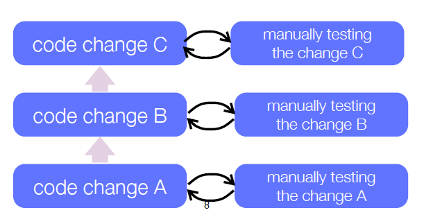

# Testing

Comunmente el testing es hecho mientras se va agregando piezas de codigo.



# Tres practicas de testing

* Durante el desarrollo, cuando se necesita agregar una nueva funcionalidad, **escribe los tests primero**, el programa se encontrará hecho cuando los test se ejecuten correctamente.
* Cuando se necesite rediseñar un software para agregar nuevas caracteristicas, haz refactors en pequeños pasos, luego **ejecuta los tests, y regression tests (test anteriores que se ejecutaban correctamente), despues de cada refactoring**.
* Durante el debugging, si se encuentra un defecto en el codigo, **escribe un test** que demuestre el defecto, entonces realiza el debug hasta que el test escrito se ejecute correctamente.

# JUnit Testing Framework

JUnit es un framework para escribir test repetibles. Puede ejecutar automaticamente los test que uno cree para el nuevo codigo que se implementa.

# Framework vs. Librerias

Tradicionalmente uno crea el `main()` y llamaba las librarias que necesitaba, en el framework, este llama automaticamente el `main()` por lo que solo basta agregar clases que implementa la aplicacion.

# JUnit 3.8

JUnit provee:

* Clases para escribir **Test Cases** y **Test Suites**.
* Metodos para setear (**setting up**) y limpiar (**cleaning up**) la data de tests.
* Metodos para crear **assertions**.
* Herramientas de texto y graficas para ejecutar tests.
  
JUnit distingue entre fallos (**failures**) y errores (**errors**):

* Un fallo es un assertion fallido (**failed assertion**), es decir, un problema anticipado que se testea.
* Un error es una condicion no chequeada, es decir, un error en tiempo de ejecucion.

# Diagrama de clases de JUnit 3.x


# Asociaciones en diagramas UML

Todas las notaciones siguientes se denominan asociaciones, ya sea de herencia, Coleccion de objetos de una clase, etc:


# Escenario de Testing: Diagrama de Secuencia


* Se llama un objeto de tipo `TestRunner` que automaticamente manda un mensaje a `TestSuite` que llama a `run()`. Posteriormente, luego de todos los envios de mensaje `run()`, `TestResult` envia un mensaje a `TestCase` para que este ejecute `runBare()`, asi `TestCase` crea los objetos necesarios para luego testear los test, finalizando con la entrega de resultados a traves de `tearDown()`.

# JUnit 3.x Ejemplo

Se crea una subclase que extienda de `TestCase` para indicar que sera una clase con la cual testearemos una clase especifica, en este caso `Money`.

```java
import junit.framework.*;

public class MoneyTest extends TestCase {
  private Money f12CHF; // fixtures
  private Money f14CHF;

  protected void setUp() { // Create the test data
    f12CHF = new Money(12, "CHF");
    f14CHF = new Money(14, "CHF");
  }
  public void testAdd() { // Create the test data
    Money expected = new Money(26, "CHF");
    assertEquals("amoun not equal", expected, f12CHF.add(f14CHF));
  }
  ...
}
```

* En `setUp()` creamos los objetos necesarios para realizar los tests.
* En `testAdd()` realizamos el test asociado a la suma de monedas de un mismo valor realizando el `assertEquals()` para asegurarnos que el valor sea igual al esperado `expected`.

# JUnit 4.x

J2SE 5 introduce la caracteristica de Metadata, un ejemplo son las anotaciones o **Annotations** que permiten agreagar decoradores al codigo (analogo a los tags de javadoc: `@author`).

Este framework provee las siguientes funcionalidades:

* Anotaciones (**Annotations**) para marcar metodos como tests.
* Anotaciones para marcar metodos que realizan el setting up y cleaning up de la data para tests (**fixtures**).
* Metodos para crear assertions.
* Herramientas de texto y graficas para ejecutar tests.

# JUnit 4.x Ejemplo

```java
import org.junit.*;
import static org.junit.Assert.*;

public class MoneyTest {
  private Money f12CHF;
  private Money f14CHF;

  @Before public void setUp() { // Create the test data
    f12CHF = new Money(12, "CHF");  // The fixture
    f14CHF = new Money(14, "CHF");
  }
  @Test public void add() { // Create the test data
    Money expected = new Money(26, "CHF");
    assertEquals("amount not equal", expected, f12CHF.add(f14CHF));
  }
}
```

* Ya no es necesario que la clase de testeo extienda de `TestCase`
* El tag `@Before` es para indicar que este metodo se debe ejecutar primero para incializar las variables de testeo.
* Ahora el tag `@Test` se utiliza para indicar el metodo encargado del test `add()`, anteriormente en JUnit 3.x se debia nombrar como `testAdd()`.

# Estilo de Testing (Testing Style)

El estilo es escribir unas pocas lineas de codigo, luego un test que pueda correrlo o, mejor aun, escribir un test que no corra, entonces escribir codigo que pueda cumplir con el test.

# Ejemplo JUnit 4.x con `Money` y `MoneyBag`

* Problema: Crear un programa que represente atirmeticamente multiples divisas. 

## `MoneyTest`

Comenzamos creando un test para la clase `Money` que se encargue de testear lo que nuestra clase debe soportar:

```java
import org.junit.*;
import static org.junit.Assert.*;

public class MoneyTest {
  private Money f12CHF;
  private Money f14CHF;

  @Before public void setUp() { // Create the test data
    f12CHF = new Money(12, "CHF");
    f13CHF = new Money(14, "CHF");
  }
  
  @Test public void testEquals() {
    assertEquals(f12CHF, f12CHF);
    assertEquals(f12CHF, new Money(12, "CHF"));
    assertFalse(f12CHF.equals(f14CHF));
  }

  @Test public void testSimpleAdd() {
    Money expected = new Money(26, "CHF");
    Money result = f12CHF.add(f14CHF);
    assertEquals(expected, result);
  }
}
```

* Creamos los metodos `testEquals()` y `testSimpleAdd()` para el testing de equivalencia y suma de divisas.
* **Notar que para el `testEquals()` debe redifinirse el metodo `equals()` en la clase `Money` pues sino se hará del metodo de la clase `Object`, en cuyo caso los tres test serán verdaderos.**

**OBS: `assertTrue()` y otros metodos son metodos estaticos de la clase `Assert` de JUnit 4.x y lanzan un AssertionError en caso de fallar.**

## `Money`

Ahora implementamos la clase `Money` que complete nuestros requerimientos de la clase `MoneyTest`.


```java
public class Money {
  ...
  public Money add(Money m) {
    return new Money(...);
  }
  ...
}
```
* Notemos que los casos de test nos guian el diseño de la clase `Money`. 
* Notemos que posibles invariantes de la clase son: que la divisa sea una divisa correcta y no inventada, que la cantidad de dinero sea positiva, etc.

**OBS:** La primera version de `Money` no considera la suma de divisas distintas.

## Testeando `MoneyBags`

Para manipular multiples divisas se introduce la clase `MoneyBag` que puede poseer varias instancias de `Money`:

```java
import static org.junit.Assert.*;

public class MoneyTest {
  ...
  @Before public void setUp() {
    f12CHF = new Money(12, "CHF");
    f14CHF = new Money(14, "CHF");
    f7USD = new Money(7, "USD");
    f21USD = new Money(21, "USD");
    fMB1 = new MoneyBag(f12CHF, f7USD);
    fMB2 = new MoneyBag(f14CHF, f21USD);
  }

  @Test public void testBagEquals() {
    assertEquals(fMB1, fMB1); // Test para comparar si dos bolsas son iguales
    assertFalse(fMB1.equals(f12CHF)); // Test para comparar si el contido de la bolsa es igual a f12CHF
    assertFalse(f12CHF.equals(fMB1));
    assertFalse(fMB1.equals(fMB2));
  }
}
```

## `MoneyBag`

Podemos utilizar una tabla de hashing para mantener un seguimiento de las monedas que se posee.


```java
public class MoneyBag {
  private Hashtable<String, Money> monies = new Hashtable<>();
  public MoneyBag(Money m1, Money m2) {
    this(new Money[]{m1, m2});
  }
  public MoneyBag(Money[] bag) {
    for(Money m : bag)
      this.appendMoney(m);
  }
  private void appendMoney(Money aMoney) {
    Money m = monies.get(aMoney.getCurrency()); // Se obtiene la referencia, no se saca la moneda de la tabla hashing
    if(m != null) { m = m.add(aMoney); }
    else { m = aMoney; }
    monies.put(aMoney.getCurrency(), m);
  }
}
```
* `String`: Tipo de divisa de la moneda.
* `Money`: Monedas de la divisa.
* En caso de recibir dos monedas, simplemente inicializo el constructor nuevamente pasandole un arreglo con las dos monedas, de esta manera se ocupa el segundo constructor.
* `appendMoney()`: Este metodo es privado pues solo se utiliza para agregar monedas al constructor.

## Agregando MoneyBags

En caso de querer sumar monedas de tipo `Money` y `MoneyBag`, se debe asegurar que el metodo `equals()` se comporte de acuerdo a este metodo.

```java
@Test public void mixedSimpleAdd() {
  // [12 CHF] + [7 USD] == {[12 CHF][7 USD]}

  Money[] bag = { f12CHF, f7USD};
  MoneyBag expected = new MoneyBag(bag);
  assertEquals(expected, f12CHF.add(f7USD));
}
```

**Sin embargo, este test falla, pues no se tiene implementado la suma de monedas de distinto tipo.**