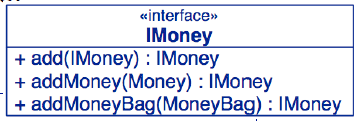

# Sumando MoneyBags

En caso de querer sumar monedas de tipo `Money` y `MoneyBag`, se debe asegurar que el metodo `equals()` se comporte de acuerdo a este metodo.

```java
@Test public void mixedSimpleAdd() {
  // [12 CHF] + [7 USD] == {[12 CHF][7 USD]}

  Money[] bag = { f12CHF, f7USD};
  MoneyBag expected = new MoneyBag(bag);
  assertEquals(expected, f12CHF.add(f7USD));
}
```

**Esto implica que `Money` y `MoneyBag` deben de implementar una interfaz en comun.**

* `f12CHF.add(f12USD)`: Como son monedas distintas debe retornar un objeto de tipo `MoneyBag`.
* `new MoneyBag().add(f12CHF)`: Retorna un `MoneyBag()`.
* `f12CHF.add(f12CHF)`: Retorna un `Money`.
* `f12CHF.add(new MoneyBag())`: Retorna un `MoneyBag`.

## Posible Solucion

```java
public class Money {
  public Object add(Object m) {
    if (m instanceof Money) { ... }
    if (m instanceof MoneyBag) { ... }
  }
}

public class MoneyBag {
  public Object add(Object m) {
    if (m instanceof Money) { ... }
    if (m instanceof MoneyBag) { ... }
  }
}
```

**Esta solucion está incorrecta pues lo que se realiza es preguntar si `m` es una instancia del tipo `Money` o `MoneyBag`, limitando a futuro la creacion de nuevas clases que se encuentren al mismo nivel que estas dos.**

## Interfaz IMoney

Las monedas saben sumarse a otras monedas.


* Como se observa, `Money` y `Moneybag` no se encuentran relaciones, es decir, no heredan una de otra o son subclases de una clase padre, sino que ambas implementan una misma interfaz. **No es correcto forzar una agrupacion si no se agrupan naturalmente**, en este caso se relacionan solamente por la interfaz.

**OBS:** Este diagrama se encuentra incompleto, luego se rellenará.

# Double Dispatch

Su traduccion literal es **Doble envio de un mensaje**, debido a que a la hora de q un objeto le llegue un mensaje, este sabe lo que debe hacer con ese mensaje y a su vez le enviará un mensaje a otro objeto.


* Al objeto `f12CHF`, de tipo `Money`, se le envia un mensaje con `add(f7USD)`, este objeto `f12CHF` sabe que es de tipo `Money`, por tanto envia un mensaje con él mismo para sumarse con `f7USD`, mensaje mostrado en el diagrama: `addMoney(this)`.

Para implementar `add()` sin romper la encapsulacion (esto es, que al agregar nuevas clase no será necesario modificar el codigo hecho para los metodos implementados), necesitamos realizar lo siguiente:

```java
class Money implements IMoney {
  ...
  public IMoney add(IMoney m) {
    return m.addMoney(this); // add me as Money
  }
  ...
}

class MoneyBag implements IMoney {
  ...
  public IMoney add(IMoney m) {
    return m.addMoneyBag(this); // add me as a MoneyBag
  }
  ...
}
```

**La idea detras de Double Dispatch es usar una llamada adicional para descubir el tipo del argumento con el que estamos lidiando.**

Luego: 

```java
class Money implements IMoney {
  ...
  public IMoney addMoney (Money m) {
    if (m.currency().equals(currency())) {
      return new Money(amount()+m.amount(),currency());
    } else {
      return new MoneyBag(this, m);
    }
  }

  public IMoney addMoneyBag(MoneyBag s) {
    return s.addMoney(this);
  }
  ...
}
```

* `MoneyBag` se encargará del resto.

# Ventajas y Desventajas de Double Dispatch

Ventajas:

* No hay violacion de la encapsulacion.
* Crear estos pequeños metodos hacen que el debugging sea facil.
* Facil de agregar nuevos tipo, pues metodos que ya existen no tenemos que modificarlos.

Desventajas:

* El control no es centralizado.
* Puede dirigir a una explosion, aumento, en la creacion de metodos de ayuda, ej: `addMoneyBag`, `addMoney`, etc.

## Interfaz `IMoney` completa



* **Se deben agregar a la interfaz los metodos de ayuda.**

```java
public interface IMoney {
  public IMoney add(IMoney aMoney);
  IMoney addMoney(Money aMoney);
  IMoney addMoneyBag(MoneyBag aMoneyBag);
}
```

**OBS:** `addMoney()` y `addMoneyBag()` solo son requeridos dentro del paquete Money, por eso no llevan modificador.

## Implementacion de equals en `MoneyBag`

```java
class MoneyBag implements IMoney {
  ...
  public boolean equals(Object anObject) {
    if (anObject instanceof MoneyBag) {
      ...
    }
    else {
      return false;
    }
  }
}
```

# Beneficios de utilizar Double Dispatch

* Los metodos son cortos en extension de codigo.
* Los metodos no contienen `ifs` ni `instanceof`. Recordar que el uso de `instanceof` solo se utiliza para preguntar en una clase por un objeto que es del tipo de esa clase.
* El codigo se vuelve mas facil de testear.
* Idealmente, el uso de `instanceof` sólo debe ser usado en el metodo `equals()`.
* El costo de agregar un nuevo tipo es muy bajo.

