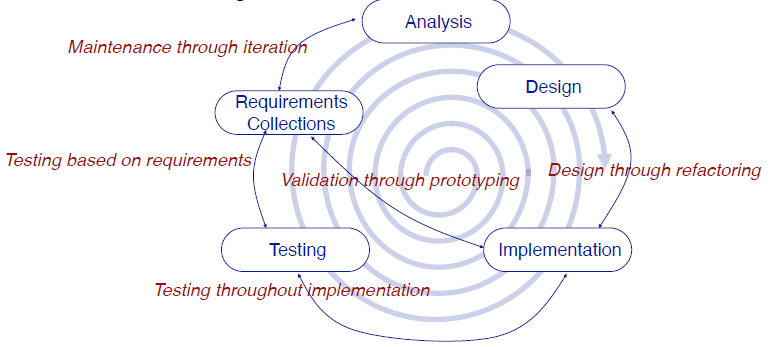
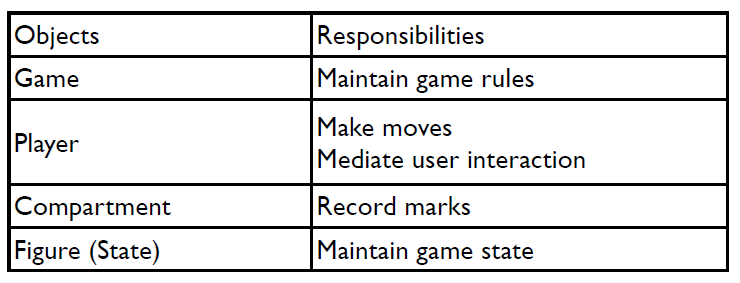
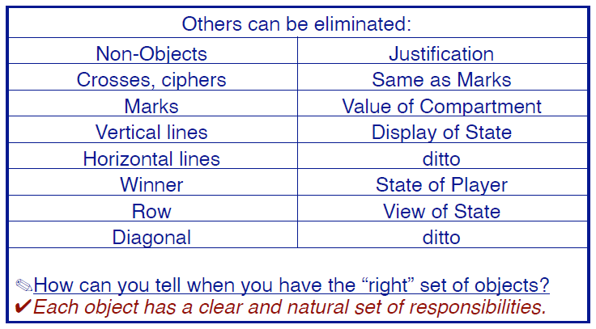
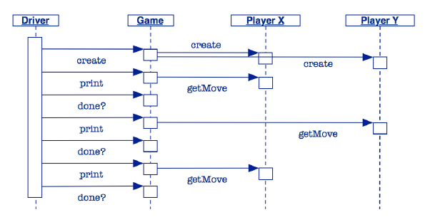
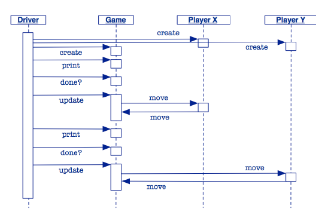

# Desarrollo Iterativo

En la practica, el desarrollo siempre es iterativo, se progresa en todas las fases de desarrollo del software en paralelo.



# Diseño guiado por la Responsabilidad (Responsibility-driven design)

Metodologia para derivar un diseño de software en términos de **objetos colaboradores**
preguntando qué **responsabilidades** deben cumplirse para satisfacer los requisitos
y **asignándolas a los objetos adecuados** (es decir, que puedan llevarlas a cabo).

## Como asignar la responsabilidad?

* **Ley de Pelrine: Nunca pongas nada en una clase si lo puede hacer alguien mas, es decir, es importante que cada clase tengo los metodos que le corresponde.**

* Las responsabilidades de una clase tienden a ser estables a lo largo del desarrollo del codigo, es decir, no cambia los metodos que posee.

# Ejemplo Tic Tac Toe

Deberiamos diseñar un programa que implemente las reglas del juego Tic Tac Toe.

## Determinando el alcance

En esta seccion se plantean las preguntas respecto a lo que tenemos que realizar:

* Deberia soportar otros juegos?
* Deberia existir una interfaz grafica?
* Deberia poder ejecutarse en un browser?
* Puede un juego tener un sistema de guardado?

**OBS:** Un diseño monolítico en papel está destinado a ser erróneo.

Una estrategia de diseño iterativa:
* Determinar el conjunto minimo de elementos que necesitamos.
* Hacer crecer el sistema agregando nuevas funcionalidades y casos de tests.
* dejar que el diseño surja mediante la refactorización de funciones y responsabilidades.

## Identificando objetos del juego (Identifying Objects)

Debido a los requisitos es posible identificar algunos objetos:



**OBS: Las entidades con responsabilidades claras tienen más probabilidades de acabar como
objetos en nuestro diseño.**



## Objetos perdidos (Missing Objects)

Ahora verificamos si hay alguna responsabilidad no asignada:

* Quien empieza el juego?
* Quien es responsable de mostrar el estado del juego?
* Como saben los jugadores cuando el juego termina?

Para este tipo de preguntas se introduce un **Driver** que supervisará el juego (Game).

## Escenarios (Scenarios)

Un escenario describe una tipica secuencia de interacciones:



## Version 0 (Skeleton)

La primera version de la aplicacion es:

```java
class GameDriver {
  public static void main(String[] args) {
    TicTacToe game = new TicTacToe();
    do { System.out.print(game);}
    while(game.notOver());
  }
  public class TicTacToe {
    public boolean notOver() { return false; }
    public String toString() { return "TicTacToe\n"; }
  }
}
```

* Como se hace crecer iterativamente el programa?
  
## Version 1 (Game State)

Utilizamos la metodologia de crear primero tests que evaluen nuestro juego:

```java
public class TicTacToeTest {

  private TicTacToe game;
  
  @Before public void setUp() {
    game = new TicTacToe();
  }

  @Test public void testState() {
    // Inicialmente el tablero esta en blanco (' ')
    assertTrue(game.get('a','1') == ' ');
    assertTrue(game.get('c','3') == ' ');
    game.set('c','3','X');
    assertTrue(game.get('c','3') == 'X');
    game.set('c','3',' ');
    assertTrue(game.get('c','3') == ' ');
    assertFalse(game.inRange('d','4'));
  }
}
```

Luego, implementamos esta version donde los movimientos son como en el ajedrez:

```java
public class TicTacToeTest {
  private TicTacToe game;

  @Before public void setUp() {
    game = new TicTacToe();
  }
  @Test public void testState() {
    assertTrue(game.get('a','1') == ' ');
    assertTrue(game.get('c','3') == ' ');
    game.set('c','3','X');
    assertTrue(game.get('c','3') == 'X');
    game.set('c','3',' ');
    assertTrue(game.get('c','3') == ' ');
    assertFalse(game.inRange('d','4'));
  }
}
```

Para lo cual la representacion del juego es:

```java
public class TicTacToe {
  private char[][] gameState;
  public TicTacToe() {
    gameState = new char[3][3];
    for (char col='a'; col <='c'; col++)
      for (char row='1'; row<='3'; row++)
        this.set(col,row,' '); // Inicializamos todas las posiciones en blanco
  }
  ...
}
```

* Adicionalmente reimplementaremos el metodo `toString()` para que imprima el tablero de juego, esta es la mejor practica (crear un nuevo metodo para imprimir el tablero seria erroneo).

  ```java
  public String toString() {
    StringBuilder rep = new StringBuilder();
    for (char row='3'; row >= '1'; row--) {
      rep.append(row);
      rep.append(" ");
      for (char col='a'; col <='c'; col++)    
        { ... }
      ...
    }
    rep.append(" a b c\n");
    return(rep.toString());
  }
  ```

* `StringBuilder`: Clase para crear objetos que concatenan strings, es mucho mas eficiente, menos costoso, que concatenar strings con `+`. Los strings se concatenan con el metodo `append`.

## Version 2 (Adding game logic)

Para esta version se agregan tests de escenarios donde aparezcan jugadores, y agregar metodos para realizar los movimientosd y para ver quien gana. Para esto:

* Actualizar el estado del juego e imprimirlo debiesen ser operaciones separadas.
* El juego debe pedirle al jugador que realize un movimiento y entonces este jugador debe intentar realizarlo.



* Ahora existen dos metodos `move` uno para `Game` y otro para `Player`, de manera que el metodo `move` de `Game` es aquel que actualiza el estado del juego a traves de los requerimientos de los movimientos de los jugadores. Cada objeto tiene control sobre su estado y no necesita que otro tipo le cambie sus variables.

Luego, se implementan nuevos tests:

```java
@Test public void testXWinDiagonal() {
  checkGame("a1\nb2\nc3\n", "b1\nc1\n", "X", 4);
}
// more tests …
public void checkGame(String Xmoves, String Omoves,
String winner, int squaresLeft) {
  Player X = new Player('X', Xmoves); // a scripted player
  Player O = new Player('O', Omoves);
  TicTacToe game = new TicTacToe(X, O);
  GameDriver.playGame(game);
  assertTrue(game.winner().name().equals(winner));
  assertTrue(game.squaresLeft() == squaresLeft);
}
```

* El metodo `testXWinDiagonal` verifica que un jugador gane con X sobre la diagonal, quedando 4 jugadas restantes, pues existen 9 espacios para completar en el tic tac toe.

Como a la hora de realizar test estos pueden interactuar muchas veces a traves de la consola, es mucho mejor realizar esta interaccion implicitamente para que no sea mostrada por consola, para esto se utiliza la clase `BufferedReader` para leer el buffer.

```java
public class Player {
  private final char mark;
  private final BufferedReader in;
}
```

Donde un jugador real leera de la entrada estandar:

```java
public Player(char mark) {
  this(mark, new BufferedReader(ew InputStreamReader(System.in)));
}
```

* **Con esto se lee directamente desde la entrada estadar de consola.**

Pero tambien un jugador puede ser construido para leer sus movimientos desde un buffer:

```java
protected Player(char initMark, BufferedReader initIn) {
  mark = initMark;
  in = initIn;
}
```

* Notemos que este constructor es `protected` pues no tiene sentido que un jugador realice todas sus jugadas de inmediato en un juego real. Este constructor solo es usado para testing, es por eso que tiene privilegio `protected`, sin embargo se utiliza para inicializar las variables de instancias.
  
Un jugador de testeo realiza sus jugadas por medio de un buffer de String:

```java 
public Player(char mark, String moves) {
  this(mark, new BufferedReader(
  new StringReader(moves)
  ));
}
```

* El constructor por default retorna un jugador que representa nada:

  ```java
  public Player() {this(' ');}
  ```

* **El hecho de crear distintos tipos de construtores donde aquel que inicializa las variables es protegido, es englobar todos los constructores en uno solo.**

## Supporting test players

* La clase `Game` ya no está encargada de instanciar a los jugadores, pero los acepta como paremetros en el constructor:

  ```java
  public TicTacToe(Player playerX, Player playerO)
  { // ...
    player = new Player[2];
    player[X] = playerX;
    player[O] = playerO;
  }
  ```

## Delegando responsabilidades

Cuando la clase `Driver` actualiza el juego, este solo le pregunta al jugador para realizar un movimiento:

```java
public void update() throws IOException {
player[turn].move(this);
}
```

* Como se observa el Driver no realiza la accion directamente.

Por otra parte el jugador, en su turno, llama al metodo `move` de la clase `Game`:

  ```java 
  public void move(char col, char row, char mark) {
    System.out.println(mark + " at " + col + row);
    this.set(col, row, mark);
    this.squaresLeft--;
    this.swapTurn();
    this.checkWinner();
  }
  ```

## Otros metodos

Introducimos otros metodos para ayudar en el flujo del juego:

```java
public boolean notOver() {
  return this.winner().isNobody()
  && this.squaresLeft() > 0;
}
private void swapTurn() {
  turn = (turn == X) ? O : X;
}
```

Obtenemos el ganador y los cuadros que quedaron sin completar:

```java
public Player winner() {
  return winner;
}
public int squaresLeft() {
  return this.squaresLeft;
}
```

* A traves de estos getters y setters protegemos las variables de instancia de posibles modificaciones maliciosas.

## GameDriver

Para poder ejecutar tests, separamos las instancias de los jugadores del juego:

```java
public class GameDriver {
  public static void main(String args[]) {
    Player X = new Player('X');
    Player O = new Player('O');
    TicTacToe game = new TicTacToe(X, O);
    playGame(game);
  }
  ...
}
```