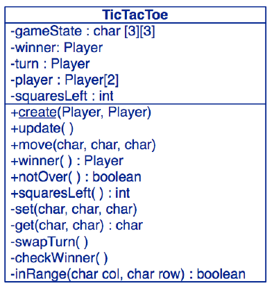
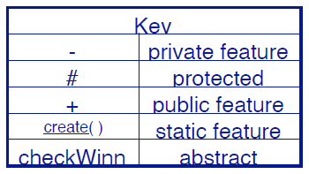
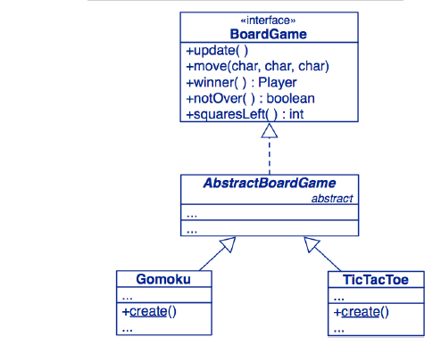
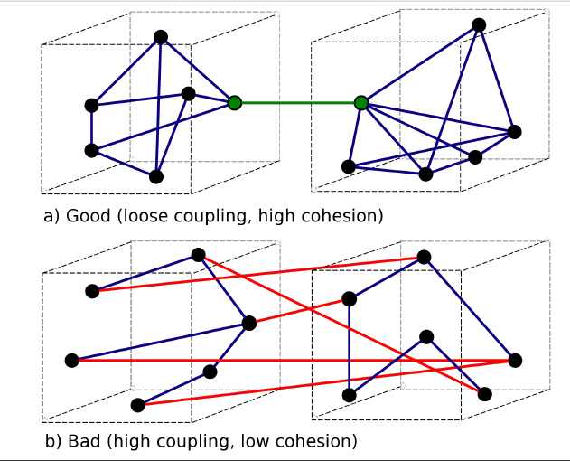

# Herencia

Dado el ejemplo del juego del gato, existen diversos juegos de este tipo, por ejemplo go-moku. Con esto en mente se plantean los siguientes conceptos relacionados a herencia:
* **Jerarquia Conceptual:** Go-moku al igual que Tic Tac Toe son juegos de mesa (`BoardGame`).
* **Polimorfismo:** Las instancias de Gomoku al igual que TicTacToe pueden ser manipuladas como instancias de juegos de mesa `BoardGame` por el cliente del programa.
* **Reuso de Software:** Gomoku y TicTacToe reutilizan la interfaz de `BoardGame`, adicionalmente extienden la representacion de juegos de mesas y las implementaciones de sus operaciones.

**Estos tres tipos de herencia pueden ser explotados por separado e independientemente.**

## Diagrama de las clases

La clases `TicTacToe` actualmente se ve de la siguiente manera:




**OBS: Explotar la herencia para reusar codigo tiende a producir codigo duplicado y producir conceptualizaciones erroneas, por ejemplo, sería una mala idea que Gomoku herede de `TicTacToe`.**

Para este caso lo mejor seria generar una interfaz `BoardGame` dado que TicTacToe y Gomoku son subtipos de esta:




# Testing Silencioso (Quiet Testing)

Una manera (poco eficiente) de realizar tests de manera que en el caso de los juegos de mesa no imprima a cada instante las jugadas es utilizando una variable booleana que en base a la evaluacion de esta muestre o no los turnos:

```java
// Esta funcion se encuentra dentro de BoardGame
public static void playGame(BoardGame game, boolean verbose) {
  ...
  if (verbose) {
    System.out.print(game)
  }
  ...
}
```

Ahora bien, una implementacion mas flexivle y mucho mejor es suplir a este metodo con un buffer `out` que indique donde se imprimirá las jugadas:

```java
public static void playGame(BoardGame game, PrintStream out) {
  try {
    do { // all printing must move here...
      out.println();
      out.println(game);
      out.print("Player "
      + game.currentPlayer().mark() + " moves: ");
      ...
    }
  }
}
```

* La clase de test `TestDriver` puede simplemente enviar la salida a un buffer nulo:

  ```java
  playGame(game, System.out);
  playGame(game, new PrintStream(new NullOutputStream()));
  ```

## NullOutputStream

La implementacion de esta clase "buffer" que se encargará de recibir los mensajes producidos por el driver para los turnos del juego no hace nada con estos:

```java

public class NullOutputStream extends OutputStream {
  // Null implementation of inherited abstract method
  @Override
  public void write(int b) throws IOException {
  }
}
```

**OBS: Los objetos nulos son utiles para eliminar flags y switches.**

# Refactoring

El **Refactoring** es el proceso de mover metodos y variables de instancias desde una clase a otra para mejorar el diseño, especificamente mediante:

* Reasignamiento de responsabilidades.
* Eliminando codigo duplicado.
* Reduciendo el **acoplamiento**: Interacciones entre las clases.
* Mejorando la **cohesion**: Interaccion dentro de las clases.

## Cohesion vs Acoplamiento

