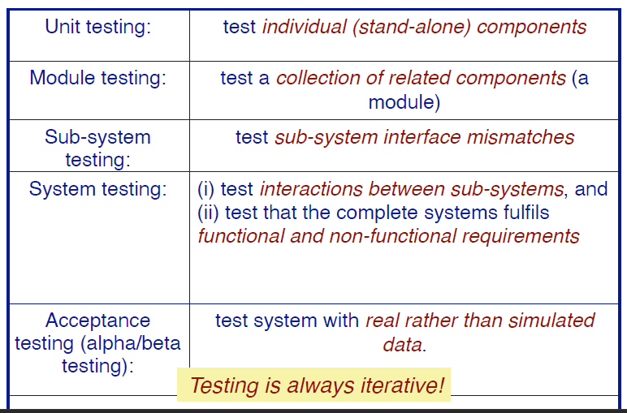
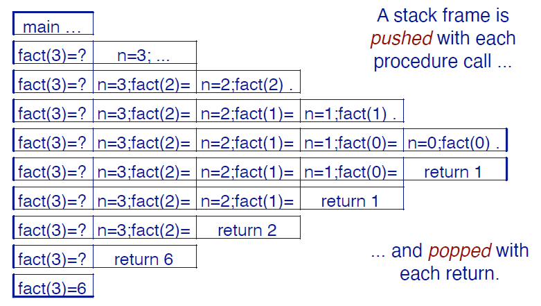
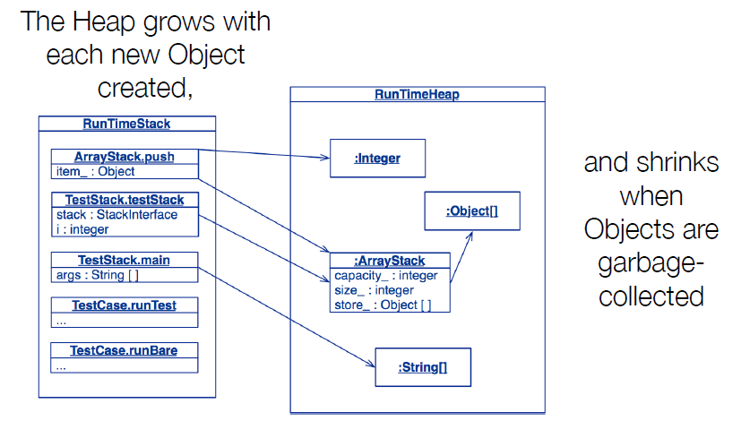
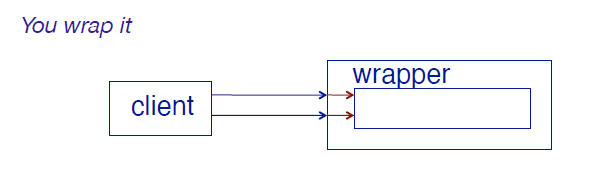

# Testing



# Regression Testing

**Las pruebas de regresión consisten en comprobar que todo lo que solía funcionar sigue funcionando después de realizar cambios en el sistema.**

* Los tests deben ser deterministas y repetibles.
* Se deberian testear "todas" las funcionalidades:
  * Cada interfaz (**black-box testing**). Se ve el programa como una caja negra, no se ve el codigo implementado.
  * Todas las casos bordes.
  * Cada caracteristica (feature).
  * Cada linea de codigo (**white-box testing**). Se ve el codigo para evaluar los test que se realizan, por ejemplo si hay un if else, entonces debo testear la parte en que se ejecuta el if y cuando se ejecuta el else.
  * Todo lo que puede salir mal!.

# Interfaces en Java

Las interfaces reducen el acoplamiento entre objetos y sus clientes. 

* Los clientes deben depender de una interfaz, no de una implementación ... así que
las implementaciones no necesitan extender una clase específica.

**OBS:** El cliente puede ser otra clase que en su implementacion ocupe como tipo la interfaz de un objeto.

# Ej. Regression Test

## StackInterface

Las interfaces nos permiten abstraer de implementaciones concretas, en este caso tenemos el tipo de dato abstracto Stack (Pila) definido por medio de una interfaz, esas son las caracteristicas basicas de un Stack:

```java
public interface StackInterface {
  public boolean isEmpty();
  public int size();
  public void push(Object item);
  public Object top();
  public void pop();
}
```
* Las interfaces reducen el acoplamiento entre objetos y sus clientes.
* Los clientes debiesen depender de una interfaz y no de una implementacion, de manera que las implementaciones no necesitan extender de una clase en especifico.

**Definir una interfaz para cualquier concepto tendrá más de una
implementación.
En cuanto diferentes clases ofrecen el mismo contrato, entonces
es necesario utilizar una interfaz**

## Testing Stack

Definimos un test de regresion para testear `StackInterface`:

```java
public class LinkStackTest {
  protected StackInterface stack;

  @BeforeEach
  public void setUp() {
    stack = new LinkStack();
  } 

  @Test
  public void empty() {
    assertTrue(stack.isEmpty());
    assertEquals(0, stack.size());
  }
}
```

* Aca tenemos un cliente que es `LinkStackTest`, pues ocupa instancias de tipo `StackInterface` en su implementacion.

**OBS:** Inicialmente el Stack se encuentra vacio.

Ahora construimos un caso de testeo y chequeamos las condiciones mas obvias de tal caso:

```java
@Test
public void oneElement() {
  stack.push("a");
  assertFalse(stack.isEmpty());
  assertEquals(1, stack.size());
  stack.pop();
  assertEquals(0, stack.size());
}
```

Chequeamos ademas que los fallos sean atrapado, en el caso de JUnit 4 se usa:

```java
@Test(expected=AssertionError.class)
public void emptyTopFails() {
  stack.top();
}

@Test(expected=AssertionError.class)
public void emptyRemoveFails() {
  stack.pop();
}
```

Equivalentemente se puede utilizar:

```java
public void emptyTopFails() {
  boolean shouldPass = false;
  try {
    stack.top();
  }
  catch (AssertionError e) {
    shouldPass = true;
  }
  assertTrue(shouldPass);
}

@Test
public void emptyRemoveFails() {
  boolean shouldPass = false;
  try {
    stack.pop();
  }
  catch (AssertionError e) {
    shouldPass = true;
  }
  assertTrue(shouldPass);
}
```

Para **JUnit 5** se tiene:

```java
@Test
public void emptyTopFails() {
  assertThrows(AssertionError.class,
    () -> stack.top() );
}
@Test
public void emptyRemoveFails() {
  assertThrows(AssertionError.class,
    () -> stack.pop() );
}
```

## ArrayStack

Se puede implementar un Stack variable usando un arreglo de tamaño fijo que almacene los elementos:

```java
public class ArrayStack implements StackInterface {
  private Object[] store;
  private int capacity;
  private int size;

  public ArrayStack() {
    store = null;
    capacity = 0;
    size = 0;
  }
}
```

Ahora bien, en el momento en que el ArrayStack se quede sin espacio, deberá crecer para poder permitir almacenar mas elementos, es decir, deberá alojar un arreglo mas grande y copiar los elementos a este arreglo.

```java
public void push(Object item) {
  if (size == capacity) {
    grow();
  }
  store[++size] = item;
}
```

Donde el metodo grow seria de la forma:

```java
private void grow() {
  if (capacity == 0) {
    capacity = 1;
    store = new Object[1];
    return;
  }

  Object[] newStore = new Objecto[capacity*2];
  for (int i=0; i< capacity; i++)
    newStore[i] = store[i];
  store = newStore;
}
```

Ahora bien, las implementaciones de los metodos definidos por la interfaz son:

```java
public boolean isEmpty() { return size == 0; }
public int size() { reurn size; }

public Object top() {
  if (this.isEmpty())
    throw new AssertionError("Cannot be empty");
  return store[size-1];
}

public void pop() {
  if (this.isEmpty())
    throw new AssertionError("Cannot be empty");
      size--;
}
```

Sin embargo, esta forma no es una buena manera de chequear las precondiciones, la siguiente forma es mucho mejor y es la que frecuentemente se utiliza:

```java
public boolean isEmpty() { return size == 0; }
public int size() { return size; }

public Object top() {
  assert(!this.isEmpty());
  return store[size-1];
}

public void pop() {
  assert(!this.isEmpty());
  size--;
}
```
* Esta notacion es mejor, pues en los compiladores es posible ajustar los parametros para que no sea leida la linea del `assert` al momento de compilar, de esta manera ocupamos esta linea solo en los momentos de testeo.

## Adapatando los casos de test

Luego, es posible hacer un override del metodo `setUp` de la clase `LinkStackTest` para asi ocupar los metodos implementados en esta clase para testear esta nueva clase:

```java
public class ArrayStackTest extends LinkStackTest {
  @BeforeEach
  public void setUp() {
    stack = new ArrayStack();
  }
}
```

# Stack de tiempo de ejecucion (Run-time Stack)

El run-time stack es una estructura de datos fundamental utilizada para registrar
el contexto de un procedimiento al que se volverá en un momento posterior.
tiempo.
Este contexto (también conocido como **stack frame**) almacena los argumentos del
procedimiento y sus variables locales.

Veamos un ejemplo para el caso de la funcion recursiva factorial:

```java
public static void main(String args[]) {
  System.out.println("fact(3) = " + fact(3));
}
public static int fact(int n) {
  if (n<=0) {
    return 1;
  } else {
    return n*fact(n-1);
  }
}
```



# Stack y Heap

El Heap es un sector de memoria donde se almacenan las variables del codigo, este va creciendo a medida que aumenta la cantidad de variables que se declaran, en Java existe un recolector de basura que se encarga de eliminar del Heap las variables que no son llamadas nuevamente.



# Limpiando el Heap

Un recolector de basura es una forma automatica de manejo de memoria.

Los principios basicos de los recolectores de basura son:
* Encontrar objetos de datos en un programa al que no se puede acceder en el futuro.
* Recuperar los recursos utilizados por esos objetos.

Los objetos a los que ya no se hace referencia simplemente se eliminan
de la memoria.

# Debuggers

Un debugger es una herramienta  que permite examinar el estado de ejecucion de un programa:
* Recorrer el programa instrucción por instrucción.
* Ver el código fuente del programa en ejecución.
* Inspeccionar (y modificar) los valores de las variables en varios formatos.
* Establecer y deshacer puntos de interrupción en cualquier parte del programa.
* Ejecutar hasta un punto de interrupción especificado.
* Examinar el estado de un programa abortado (en un "archivo central")

## Estrategia de Debugging cuando se ejecuta la aplicacion

Si surgen errores durante la ejecucion de la aplicacion:
* Primero hay que entender cual es el **escenario de ejecucion** que causó el error.
* Es esencial estar seguro de que tenemos el escenario problematico. **Escribir un test que reproduzca el escenario.**
* **Ejecutar este nuevo test** para asegurarse de que falla.
* **Corregir el bug** en la aplicacion.
* **Ejecutar el test nuevamente** para estar seguros de que hemos corregido el bug.

# Wrapping Objects (Objetos envolventes)

El **wrapping** es una técnica de programación fundamental para
integración de sistemas.

¿ Que hacemos con un objeto cuya interfaz no se ajusta a los requerimiento que necesitamos?



## `java.util.Stack`

La implementacion de un Stack hecha por Java es:

```java
public class Stack extends Vector {
  public Stack();
  public Object push(Object item);
  public synchronized Object pop();
  public synchronized Object peek();
  public boolean empty();
  public synchronized int search(Object o);
}
```

* Como vemos Stack es un subtipo de Vector, es decir, no a la hora de inicializar una variable de este tipo tambien tendrá las caracteristicas de un `Vector`.

## Wrapped Stack

Una clase envolvente (wrapper class) implementa una interfaz necesaria, delegando
las solicitudes a una instancia de la clase envuelta (wrapped class):

```java
public class SimpleWrappedStack implements StackInterface {
  private Stack stack;
  public SimpleWrappedStack() { stack = new Stack(); }
  public boolean isEmpty() { return stack.empty(); }
  public int size() { return stack.size(); }
  public void push(Object item) { stack.push(item); }
  public Object top() { return stack.peek(); }
  public void pop() { stack.pop(); }
}
```

* `synchronized` asegura que el acceso a el Stack sea seguro si el objeto se comparte entre distintos threads, es decir asegurando concurrencia.

**Sin embargo, esta implementacion falla, pues no se consideran los casos en que `top` o `pop` sean usados en un Stack vacio**. Por tanto se debe solucionar:

```java
public class WrappedStack implements StackInterface {
  public Object top() {
    assert(!this.isEmpty());
    return super.top();
  }
  public void pop() {
    assert(!this.isEmpty());
    super.pop();
  }
  ...
}
```

* Agregamos `assert` para chequear la precondicion de que el Stack no se encuentre vacio. Estas lineas de codigo solo se utilizan para tests, al momento de ejecutar y compilar esta linea se omite con las opciones de compilacion.