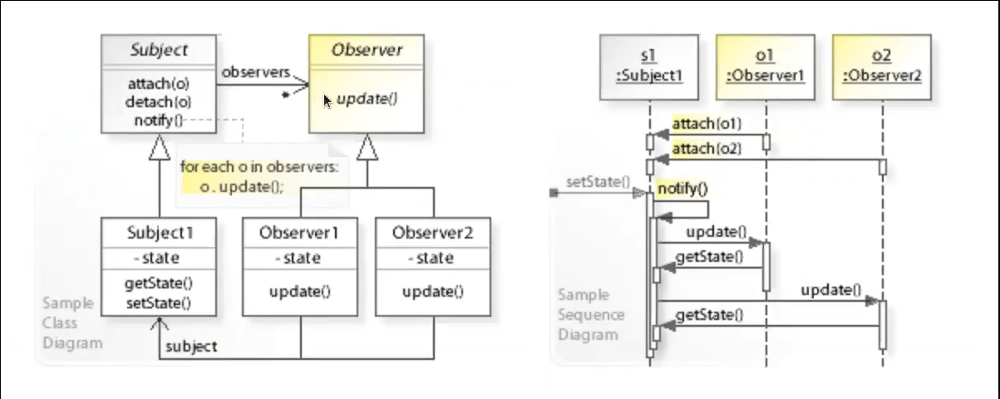
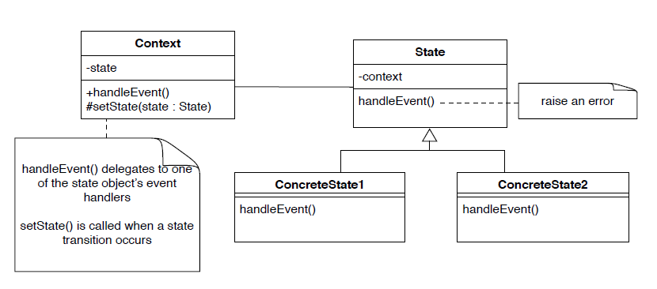

# Patrones de diseño

# Adapter Pattern (Adaptador)

¿Como utilizamos una clase que provee los rasgos correctos pero una interfaz incorrecta?
* Se utiliza un adaptador.

Un adaptador convierte la interfaz de una clase hacia otra que espera el cliente.
* El cliente y el objeto adaptado mantienen la indepencencia, no se conocen entre ellos.
* Un adaptador agrega un nivel extra de indireccion.
* La clase adaptadora tendrá como variable de instancia la clase que se esta adaptando para que la ocupe el cliente.

Este patron tambien se conoce como **Wrapper**.

## Ejemplo

```java
class LegacyRectangle implements Shape {
  public void draw(int x, int y, int w, int h) {
    System.out.println("rectangle at ("+x+','+y+") with width " +w+"and height"+h);
  }
}

class Rectangle implements Shape {
  private LegacyRectangle adaptee = new LegacyRectangle();
  public void draw(int x1, int y1, int x2, int y2)
  {
    adaptee.draw(Math.min(x1, x2), Math.min(y1, y2), Math.abs(x2 - x1),
    Math.abs(y2 - y1));
  }
}
```

* Utilizamos como variable de instancia un objeto de tipo `LegacyRectangle`, cambiando la interfaz que existe.

# Proxy Pattern

¿Como escondes la complejidad de acceder a objetos que requieren un pre o post procesamiento?

* Para esto se introduce un **proxy** que controla el acceso al objeto.

## Proxy Pattern UML


* Como se observa la clase `Proxy` tendrá como variable de instancia un objeto de tipo `RealSubject` (pero al instanciarla se declara de tipo `Subject`) al cual le hará pre o post procesamiento.

## Ejemplo


* Cuando se crea una imagen esta no se dibujará hasta que se carge la imagen, pues sino se estará utilizando recursos de forma ineficiente. Para esto al crearse la imagen, se crea un objeto de tipo `ProxyImage` donde al momento de mostrar la imagen se utiliza la variable de instancia que posee esta clase de tipo `RealImage`.

```java
public class ProxyImage implements Image {
  private String filename;
  private Image image;

  public ProxyImage(String filename) {
    this.filename = filename;
    this.image = null;
  }

  public void displayImage() {
    if (image == null) {
      image = new RealImage(filename); // load only on demand
    }
    image.displayImage();
  }
}
```
```java
public class RealImage implements Image {
  private String filename;

  public RealImage(String filename) {
    this.filename = filename;
    System.out.println("Loading "+filename);
  }

  public void displayImage() {
    System.out.println("Displaying "+filename);
  }
}
```

El cliente:

```java
public class ProxyExample {
  public static void main(String[] args) {
    ArrayList<Image> images = new ArrayList<Image>();
    images.add(new ProxyImage("HiRes_10MB_Photo1"));
    images.add(new ProxyImage("HiRes_10MB_Photo2"));
    images.add(new ProxyImage("HiRes_10MB_Photo3"));
    images.get(0).displayImage();
    images.get(1).displayImage();
    images.get(0).displayImage(); // already loaded
  }
}
```

* Los proxies son utilizados para accesar a objetos remotos, por ejemplo:
  * Un **stub** en Java para accesar a objetos remotos mediante el metodo de invocacion remota (**RMI, Remote Method Invocation**).

Las consecuencias son:
* **Un Proxy desacopla a los clientes de los servidores. Este introduce un nivel de indireccion.**

**Un Proxy difiere del Adaptador en que este no cambia la interfaz de los objetos.**

## Ejemplo Proxy para acceso remoto


# Observer Pattern (Observador)

¿Como puede un objeto informar arbitrariamente a los clientes cuando su estado cambia?

* Los clientes implementan una interfaz común de observadores (`Observer`) y se registran con el
objeto "observable"; el objeto notifica a sus observadores cuando cambia de estado.

* Un objeto observable publica eventos de cambio de estado a sus
suscriptores, que deben implementar una interfaz común para
recibir notificaciones.

## Observer Pattern UML



## Problema Observer Pattern

Veamos el siguiente ejemplo: Un boton espera que sus observadores implementen la interfaz `ActionListener`, sin embargo la notificacion puede tardar si es que existen demasiados observadores (recorrer la lista de observadores tardará mucho) o si los propios observadores tambien son observables.

## Ejemplo

Sea un objeto que es observado de tipo `EventSource` y un objeto observable de tipo `Observable`.

* Observable:
  
```java
package obs;

import java.util.Observable; //Observable is here
import java.io.BufferedReader;
import java.io.IOException;
import java.io.InputStreamReader;

public class EventSource extends Observable implements Runnable {
  public void run() {
    try {
      final InputStreamReader isr = new InputStreamReader( System.in );
      final BufferedReader br = new BufferedReader( isr );
      while( true ) {
        String response = br.readLine();
        setChanged();
        notifyObservers( response );
      }
    }
    catch (IOException e) {
      e.printStackTrace();
    }
  }
}
```

* Observador:
  
```java
package obs;

import java.util.Observable;
import java.util.Observer; /* this is Event Handler */

public class ResponseHandler implements Observer {
  private String resp;
  public void update (Observable obj, Object arg) {
    if (arg instanceof String) {
      resp = (String) arg;
      System.out.println("\nReceived Response: "+ resp );
    }
  }
}
```
 Notemos que se hace uso de `instanceof`, pero en este caso se sabe que el tipo de `arg` necesariamente debe ser `String`.

* Uso:

```java
package obs;

public class MyApp {
  public static void main(String args[]) {
    System.out.println("Enter Text >");
    // create an event source - reads from stdin
    final EventSource evSrc = new EventSource();
    // create an observer
    final ResponseHandler respHandler = new ResponseHandler();
    // subscribe the observer to the event source
    evSrc.addObserver( respHandler );
    // starts the event thread
    Thread thread = new Thread(evSrc);
    thread.start();
  }
}
```

## Problema con Observer/Observable

Notemos que hacemos uso de `instanceof` para el observador, desde Java 9 en adelante se implementó una clase `PropertyChangeSupport` y una interfaz `PropertyChangeListener` que pueden ser utilizadas para el objeto observable y el observador respectivamente.

```java
public class EventSource implements Runnable {
  private PropertyChangeSupport changes;
  public EventSource() {
    changes = new PropertyChangeSupport(this);
  }
  public void addObserver(ResponseHandler resp) {
    changes.addPropertyChangeListener(resp);
  }
  public void run() {
    try {
      // We declare two constant in the code
      // the final keyword forbid from later assignment
      final InputStreamReader isr = new InputStreamReader( System.in );
      final BufferedReader br = new BufferedReader( isr );
      while( true ) {
        String response = br.readLine();
        if(response.equals("quit")) return;
        changes.firePropertyChange(new PropertyChangeEvent(this, "entered
        text", null, response));
      }
    }
    catch (IOException e) {
      e.printStackTrace();
    }
  }
}
```

```java
public class ResponseHandler implements PropertyChangeListener {
  @Override
  public void propertyChange(PropertyChangeEvent evt) {
    System.out.println("\nReceived Response: "+ evt.getNewValue() );
  }
}
```

```java
public class MyApp {
  public static void main(String args[]) {
    System.out.println("Enter Text >");
    // create an event source - reads from stdin
    final EventSource evSrc = new EventSource();
    // create an observer
    final ResponseHandler respHandler = new ResponseHandler();
    // subscribe the observer to the event source
    evSrc.addObserver(respHandler);
    // starts the event thread
    Thread thread = new Thread(evSrc);
    thread.start();
  }
}
```

# Hanlding States

Esta metodologia es util para manejar los estados de un objeto.


## Ejemplo (incorrecto)

```java
while ((line = in.readLine()) != null) {
  if (line.equals("open")){
    changeState(CLOSED, OPENED);
  }
  if (line.equals("close")){
    changeState(OPENED, CLOSED);
  }
  if (line.equals("lock")){
    changeState(CLOSED, LOCKED);
  }
  if (line.equals("unlock")){
    changeState(LOCKED, AWAITING_COMBINATION);
  }
  if (line.equals("combination")){
    changeState(AWAITING_COMBINATION, CLOSED);
  }
  if (line.equals("error")){
    changeState(AWAITING_COMBINATION, LOCKED);
  }
  this.prompt();
}
```
* Dada una variable de instancia, preguntamos su estado para ver que hacemos.
* Esta forma es incorrecta pues observamos que existen muchas condiciones posibles que probablemente se pueda organizar de mejor manera.
* Notemos que si aparece un nuevo estado, deberá agregarse al codigo.

De esta manera nace el siguiente patron de diseño:

# State Pattern



* Los estados saben como cambiar/reaccionar.
* Como se observa el `Context` tiene una variable de instancia de tipo `State` con la cual sabe el estado, ademas `State` tambien posee una variable de instancia de tipo `Context` para conocer el contexto.
* `Context` maneja el evento, delegando esta responsabilidad a `State`. Cada estado va a saber cuando se produce un cambio de estado o no, enviando un error en el ultimo caso.
* `Context` puede estar en un estado `ConcreteState1` o `ConcreteState2`, alguno de estos dos estados cambiará la variable de instancia `state` de `Context`.
* Es posible agregar nuevos metodos a la clase `Context`, pero no redefinir los existentes.
* Adicionalmente es posible editar todos los metodos de manejos de eventos `handleEvent()` para que lanzen un error por defecto para que al momento de que los objetos de estados concretos utilicen alguno de estos que no se haya redifinido, pues no lo utiliza, se lance la advertencia.

**OBS: La variante de esta metodologia que utiliza una interfaz en vez de una clase para `State` tambien existe, sin embargo esto puede producir codigo duplicado, pues no necesariamente queremos redefinir o heredar todos los metodos de la clase `State` para las subclases de estados concretos, probablemente solo se necesitará redefinir un par de metodos de los heredados.**

# Ejemplo

Veamos el ejemplo de una caja fuerte que puede abrirse, cerrarse o bloquearla.


* Los estados concretos solo redefinen un subconjunto de los metodos de la clase `State`.
* El contexto para la caja fuerte es la clase `Safe`.

* `Safe`:

  ```java
  public class Safe {
    private State state;
    public Safe () {
      this.setState(new Open());
    }
    void setState(State aState) {
      state = aState;
      state.setSafe(this);
    }
    public void open() { state.open(); }
    public void close() { state.close(); }
    public void lock() { state.lock(); }
    public void enterCode() { state.enterCode(); }
    public boolean isOpen() { return state.isOpen(); }
    public boolean isClosed() { return state.isClosed(); }
    public boolean isLocked() { return state.isLocked(); }
  }
  ```
  * Inicializamos la caja fuerte seteando el estado a `Open`.

* `State`:

  ```java
  public class State {
    private Safe safe;
    public void setSafe(Safe safe) {
    this.safe = safe;
    }
    protected void changeState(State state) {
    safe.setState(state);
    }
    void error() { throw new AssertionError(“Wrong state”); }
    void open() { error(); }
    void close() { error(); }
    void enterCode() { error(); }
    void lock() { error(); }
    public boolean isOpen() { return false; }
    public boolean isClosed() { return false; }
    public boolean isLocked() { return false; }
  }
  ```
  * Por defecto los metodos de manejo de eventos lanzan error.
* `Open`, `Close` y `Locked`:
```java
public class Open extends State {
  void close() { this.changeState(new Close()); }
  public boolean isOpen() { return true; }
}

public class Close extends State {
  void open() { this.changeState(new Open()); }
  void lock() { this.changeState(new Locked()); }
  public boolean isClosed() { return true; }
}

public class Locked extends State {
  void enterCode() { this.changeState(new Close()); }
  public boolean isLocked() { return true; }
}
```

### Testing

```java
public class SafeTest {
  private Safe safe;
  @Before
    public void setUp() {
    safe = new Safe();
  }
  @Test
  public void testCreation() {
    assertTrue(safe.isOpen());
    assertFalse(safe.isClosed());
    assertFalse(safe.isLocked());
    safe.close();
    assertFalse(safe.isOpen());
    assertTrue(safe.isClosed());
    assertFalse(safe.isLocked());
  }…
}
```

# Conclusion

Las patrones de diseño:
* Se basan en la experiencia de diseño.
* Permiten la reutilizacion de arquitectura de software.
* Mejoran la comunicacion entre equipos de desarrollo de software. En un proyecto que utilice un patron de diseño basta con mencionar en la documentacion el patron de diseño que se utilizó, sin tener que documentar nada mas.