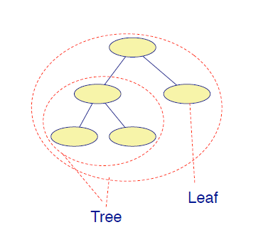

# Template Method Pattern

¿Cómo se implementa un algoritmo genérico, posponiendo algunas
partes a las subclases?

* Solucion: Denirlo como un metodo plantilla (**Template Method**).

Un Template Method factoriza la parte común de algoritmos similares
y delega el resto a:
* métodos gancho (**hook methods**) que las subclases pueden extender, y
* métodos abstractos que las subclases deben implementar.

## Ejemplo

* El metodo `init()` de la clase `AbstractBoardGame` estaba implementado en esta, pero dentro llamaba a un metodo que se encontraba definido en subclases de esta.
* `TestCase.runBare()` es un Template Method que llama al metodo gancho (hook method) `SetUp()`

Las consecuencias de este patron de diseño son:
* Template Method conducen a una estructura de control invertida, ya que una clase padre
llama a las operaciones de una subclase y no al revés.
* El Template Method se utiliza en la mayoría de los frameworks para
permitir a los programadores de aplicaciones extender fácilmente la funcionalidad de
las clases del framework.

## UML Template Method


* `templateMethod()` llama dentro de ella a un metodo `primitiveOperation()` de cualquiera de sus subclases.
* `primitiveOperation()` es un **hook method** que puede ser abstracto o vacio, sus subclases lo redefinen.

# Composite Pattern

¿Como manejamos una jerarquia de objetos, completa o parte de ella, de una manera consistente?
* Definir una interfaz común que implementen tanto las piezas como los compuestos (**composites**).

Normalmente, los objetos compuestos (**composite objects**) implementan su comportamiento
delegandolo a sus partes que lo componen.

## UML Composite Pattern


* El elemento compuesto `Composite` contiene una lista de elementos `Component` y por tanto estos pueden ser de tipo `Leaf` o `Composite`.

* Las metodos `operation()` se redefinen en las hojas y en los elementos compuestos, donde en este ultimo caso se baja hasta las hojas para realizar la operacion.


## Ejemplo

Composite permite tratar una unica instancia de un objeto de la misma forma en que se trata un grupo de estos objetos.

Por ejemplo, el arbol de la imagen consiste de arboles (subarboles) y hojas como objetos.



Supongamos ahora queremos modelar el mundo, primero estan los continentes, luego los paises y ciudades.

* `Component`, `Composite`:
  ```java
  public interface Component {
    int getValue();
  }

  public class Composite implements Component {
    private List<Component> components = new ArrayList<Component>();
    @Override
    public int getValue() {
      int s = 0;
      for (Component c : components) s += c.getValue();
      return s;
    }
    public void add(Component component) {
      components.add(component);
    }
  }
  ```
  * El numero de habitantes por pais se calcularia obteniendo el numero de habitante de cada ciudad (Composite).

* Ciudad (`Component`):

  ```java
  public class City implements Component {
    private int inhabitant;
    public City(int inhabitant) { this.inhabitant = inhabitant; }
    @Override
    public int getValue() { return inhabitant; }
  }

  public class Example {
    public static void main(String[] arg) {
      Composite chile = new Composite();
      City santiago = new City(6300000);
      City serena = new City(201000);
      City vina = new City(289000);
      chile.add(santiago);
      chile.add(serena);
      chile.add(vina);
      Composite southAmerica = new Composite();
      southAmerica.add(chile);
      System.out.println(southAmerica.getValue());
    }
  }
  ```

  * El numero de habitantes es solo por ciudad.

# Null Object Pattern

¿Cómo se puede evitar saturar el código con test de punteros de objetos nulos?

* Introduciendo un objeto nulo (**Null Object**) que implementa la interfaz que se espera, pero que no haga nada.

**Los objetos nulos también pueden ser objetos Singleton, ya que nunca necesita más de una instancia.**

## UML Null Object 


* El metodo `doAction()` de la clase `NullElement` no hace nada

* Un ejemplo de esta implementacion es la clase `NullOutputStream` que extiende de `OutputStream` con un metodo `write()` vacio. Usualmente esto se ocupa a la hora de hacer testing.


Las consecuencias de este patron de diseño son:
* Simplifica el codigo del cliente.
* Sin embargo, no vale la pena si sólo hay pocos y localizados test para los punteros nulos.

# Factory Pattern

¿Como se puede externalizar la creacion de objetos?, para asi no preguntar cada vez el tipo de estos.
* Se utiliza una clase fabrica que construya los objetos personalizados.

**Una fabrica crea los objetos sin exponer la instanciacion logica al cliente. Se inicializan los objetos en metodos de la clase fabrica. Toda la carga para inicializar objetos está oculta**

## UML Factory Pattern


* La fabrica `Factory` retorna productos que cumplen con la interfaz `Product`.

## Ejemplo juego Lara Croft


* Como en este caso se implementan distintos tipos de municiones, se crea una interfaz mucho mas general que será la fabrica de municion.

* `Lara`:
  ```java
  public class Lara {
    private AmmoFactory ammoFactory;
    public Ammo fire() {
      return ammoFactory.create();
    }
    public void setAmmoFactory(AmmoFactory anAmmoFactory) {
      ammoFactory = anAmmoFactory;
    }
  }
  ```
  * Con el metodo `fire()` se puede disparar cualquier objeto de la fabrica.

* `Ammo`, `AmmoFactory`, `Arrow` y `ArrowFactory`:
  ```java
  public interface Ammo {
  }

  public class Arrow implements Ammo {
  }

  public interface AmmoFactory {
    Ammo create();
  }

  public class ArrowFactory implements AmmoFactory {
    @Override
    public Arrow create() {
      return new Arrow();
    }
  }
  ```
* Test:
  ```java
  @Test
  public void test() {
    Lara lara = new Lara();
    lara.ammoFactory(new ArrowFactory());
    assertEquals(lara.fire().getClass(), Arrow.class);
  }
  ```

## Fabrica e inicializacion de objetos

Tener un constructor que acepte muchos argumentos reduce la legibilidad. Una fábrica puede simplificar mucho la inicialización de los objetos. Por ejemplo:

```java
public class Arrow implements Ammo {
  /* Many arguments */
  public Arrow(int pikeSize, Color color, int arrowSize, ArrowMaterial m) {
    …
  } 
  public Arrow(int arrowSize, ArrowMaterial m) { 
    this(5, Color.BROWN, arrowSize, m);
  }
  ...
}
```

Una fabrica puede simplificar la inicializacion:
  ```java
  ArrowFactory factory = new ArrowFactory();
  factory.setSize(10);
  factory.setColor(Color.BLUE);
  factory.create();
  ...
  ```

* Se tiene un conjunto de metodos con los cualesd se setean las caracteristicas.

## Terminologia (Factory Method)


* Arriba se observa el diagrama UML para lenguajes que no poseen interfaces, por tanto heredan de clases abstractas.

# Singleton Pattern

¿Como se prohibe más de una instanciacion para una clase particular?

* Un patrón singleton (Singleton Pattern) asegura que no se pueda obtener más de una instancia
de una clase.

**Debe ser utilizado con cuidado porque introduce un estado global.**

## Ejemplo Lara Croft

En el juego solo es necesario que exista una sola protagonista, Lara Croft:


```java
public class Lara {
  private static Lara uniqueInstance;
  private Lara () { }
  public static Lara uniqueInstance() {
    if(uniqueInstance == null) {
      uniqueInstance = new Lara();
    }
    return uniqueInstance;
  }
  ...
}
```
* Se instancia un objeto de tipo `Lara`, de instancia unica, por lo que se utiliza la keyword `static`.
* Si esta variable es nula, se crea una instancia del objeto, sino se retorna el objeto.

# Flyweight Pattern

¿Cómo se puede dar soporte a un gran número de objetos individuales de grano-fino (fine-grained) de forma eficiente?
* Un patrón de peso mosca (Flyweight Pattern) permite reutilizar objetos calificados como innecesarios.
* Un objeto que tiene el mismo estado que otro solo se almacena una vez. De esta manera se compara a nivel de direccion y contenido.

La creación de muchos objetos puede ser la causa de un mal rendimiento de la memoria.

* El almacenamiento de objetos de vida corta en una tabla hash permite reutilizarlos fácilmente

## Ejemplo UML Flyweight Pattern


* Sin Flyweight Pattern:
  ```java
  public class ColorFactory {
    public Color getColor(int red, int green, int blue) {
      return new Color(red, green, blue);
    }
  }
  public class ColorfulTest {
    @Test
    public void testFactory(){
      ColorFactory f = new ColorFactory();
      Color c1 = f.getColor(255, 0, 0);
      Color c2 = f.getColor(255, 0, 0);
      assertEquals(c1, c2);
      assertTrue(c1 == c2);
    }
  }
  ```
  * El `assertEquals(c1,c2)` compara contenido mientras que `assertTrue(c1==c2)` compara direcciones de memoria, por tanto este ultimo test fallará.

* Con Flyweight Patter:
  ```java
  public class ColorFactory {
    private Hashtable<List<Integer>,Color> hashtable = new Hashtable<>();
    public Color getColor(int red, int green, int blue) {
      Integer[] array = { red, green, blue };
      List<Integer> key = Arrays.asList(array);
      Color color = hashtable.get(key);
      if(color != null)
        return color;
      else {
        color = new Color(red, green, blue);
        hashtable.put(key, color);
      }
      return color;
    }
  }
  ```
  * Se utiliza una tabla hash para guardar los objetos.
  * En base al codigo de color se crea una clave con la cual guardar el objeto en la tabla.
* Otra forma correcta:
  ```java
  public class ColorFactory {
    private static HashMap<Integer,Color> colorCache = new HashMap<>();
    public static Color getColor(int red, int green, int blue) {
      int key = red * 256 * 256 + green * 256 + blue;
      if(colorCache.containsKey(key))
        return colorCache.get(key);
      else {
        Color c = new Color(red, green, blue);
        colorCache.put(key, c);
        return c;
      }
    }
  }
  ```

**De esta manera ahora el test pasará pues la direccion de memoria es la misma.**

# Clasificacion de los Patrones de Diseño

## Patrones de Creacion

* Abstrac Factory, Builder, Factory Method, Lazy Initialization, Singleton.

## Patrones Estructurales

* Adapter (wrapper), Bridge, Composite, Decorator, Facade, Flyweight, Proxy.


## Patrones de Comportamiento

* Command, Interpreter, Iterator, Null Object, Observer, State, Template Method, Visitor.

## Patrones de Concurrencia

* Active Objects, Balking Lock, Monitor Object, Thread Pool, Scheduler.