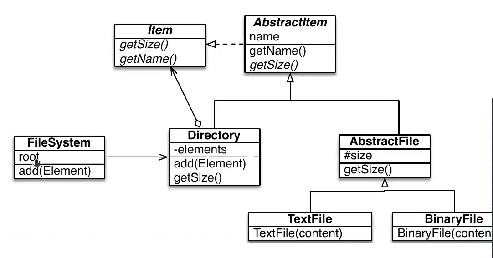

# Ejercicio

Un **file system** es un componente esencial de muchos sistemas operativos. Para este ejercicio vamos a considerar que posee los siguientes elementos:

* Un file system tiene files y directories.
* Un file puede ser textual ffile (archivo de texto) o un binary file (ejecutable).
* Un file system tiene solamente un directory root.
* Un directory puede contener textual files, binary files y directories.
* Cada elemento de un file system tiene un tamaño y un nombre.

## Diagrama UML



* El patron de diseño utilizado es **Composite**, pues tenemos una jerarquia de objetos.

* El metodo `getSize()` es recursivo, pues para el caso de la clase `Directory` este recorre los archivos y directorios de la lista de objetos de tipo `Item`.

**OBS:** Existe un error en este diagrama, en vez de `Element` en el metodo `add` y en la variable de instancia de `Directory`, el objeto debe ser de tipo `Item`.

## Testing

Comenzamos realizando los test que deben pasarse:

```java
public class FileSystemTest {
  private FileSystem emptyFs, fs;
  private Directory d1, d2;

  @Before
  public void setUp() {
    emptyFs = new fileSystem();

    d1 = new Directory("d1");
    d2 = new Directory("d2");
    d1.add(d2);
    d1.add(new TextFile("file.txt", "hello world!"));

    byte[] c = {'1', 'c'};
    d1.add(new BinaryFle("file.txt",c));

    fs = new FileSystem();
    fs.add(d1);
  }

  @Test
  public void testGetSize() {
    assertEquals(0, emptyFs.getSize());
    assertEquals(14, fs.getSize());
  }
}
```

* `getSize()` debe dar 14 pues cuenta el numero de caracteres de los tipos de archivo.

## Composite
* `FileSystem`:
  ```java
  public class FileSystem {
    private Directory root;

    public FileSystem() {
      root = new Directory("root");
    }

    public void add(Item item) {
      root.add(item);
    }

    public int getSize() {
      return root.getSize();
    }
  }
  ```
* `Item`:
  ```java
  public interface Item {
    int getSize();
    String getName();
  }
  ```
* `AbstracteItem`:
  ```java
  public abstract class AbstractItem implements Item {
    private String name;

    @Override
    public abstract int getSize();

    @Override
    public String getName() {
      return name;
    }

    public AbstractItem(String aName) {
      name = aName;
    }
    }
  } 
  ```
* `Directory`:
  ```java
  public class Directory extends AbstractItem {
    private List<Item> items = new ArrayList<>();

    public Directory(String aName) {
      super(aName);
    }

    public void add(Item anItem) {
      items.add(anItem);
    }

    @Override
    public int getSize() {
      int result = 0;
      for (Item item: items)
        result += item.getSize();
      return result;
    }
  }
  ```
* `AbstractFile`:
  ```java
  public class AbstractFile extends AbstractItem {
    protected int size;
    
    public AbstractFile(String aName) {
      super(aName);
    }

    @Override
    public int getSize() {
      return size;
    }
  }
  ```
* `TextFile` y `BinaryFile`:
  ```java
  public class TextFile extends AbstractFile {
    public TextFile(String aName, String content) {
      super(aName);
      size = content.lenght();
    }
  }

  public class BinaryFile extends AbstractFile {
    public BinaryFile(String aName, byte[] content) {
      super(aName);
      size = content.lenght;
    }
  }
  ```

# Ejercicio

Ahora quisieramos agregar algunas operaciones:
* Obtener el numero total de files contenidos en un file system.
* Obtener el numero total de directorios contenidos en un file system.
* Hacer un listado recursivo.
* Etc.

## Testing

```java
@Test
public void testGEtNumberOfFile() {
  assertEquals(0, emptyFs.getNumberOfFiles());

  assertEquals(2, fs.getNumberOfFiles());

  TextFile aFile = new TextFile("tmp.txt", "a file system example");
  Directory d = new Directory("another directory");
  d.add(aFile);
  fs.add(d);
  assertEquals(3, fs.getNumberOfFiles());
}

@Test
public void testGetNumberOfDirectory() {
  assertEquals(1, emptyFs.getNumberOfDirector());

  assertEquals(3, fs.getNumberOfDirectory());

  TextFile aFile = new TextFile("tmp.txt", "a file system example");
  Directory d = new Directory("another directory");
  d.add(aFile);
  fs.add(d);
  assertEquals(4, fs.getNumberOfDirectory());
}

@Test
public void testListing() {
  String result = "root\n";
  assertEquals(result, emptyFs.listing());

  result = "root\nd1\nd2\nfile.txt\nfile.onj\n";
  assertEquals(result, fs.listing());
}
```

## Composite

Ahora el Composite varia:

* `Item`:
  ```java
  public interface Item {
    int getSize();
    String getName();
    int getNumberOfFiles();
    int getNumberOfDirectory();
    String listing();
  }
  ```

* `AbstractItem`:
  ```java
  public abstract class AbstractItem implements Item {
    private String name;

    @Override
    public abstract int getSize();

    @Override
    public String getName() {
      return name;
    }

    public AbstractItem(String aName) {
      name = aName;
    }

    public abstract int getNumberOfFiles();
    public abstract int getNumberOfDirectory();
    public abstract String listing();
  }
  ```
* `Directory`:
  ```java
  public class Directory extends AbstractItem {
    ...
    @Override
    public int getNumberOfFiles() {
      int result = 0;
      for(Item item : items)
        result += item.getNumberOfFiles();
      return result;
    }

    @Override
    public int getNumberOfDirectory() {
      int result = 1;
      for(Item item : items)
        result += item.getNumberOfDirectory();
      return result;
    }

    @Override
    public String listing() {
      StringBuilder sb = new StringBuilder();
      sb.append(this.getName()).append("\n");
      for(Item item : items)
        sb.append(item.listing());
      return sb.toString();
    }
  }
  ```
  * Notemos que la variable `result` en el metodo `getNumberOfDirectory()` se inicializa asignadole el valor 1 pues nos encontramos en un directorio.

* `AbstractFile`:
  ```java
  public class AbstractFile extends AbstractItem {
    protected int size;

    public AbstractFile(String aName) {
      super(aName);
    }

    @Override
    public int getNumberOfFiles() {
      return 1;
    }

    @Override
    public int getNumberOfDirectory() {
      return 0;
    }

    @Override
    public String listing() {
      return this.getName() + "\n";
    }

    @Override
    public int getSize() {
      return size;
    }
  }
  ```
  * En este caso los metodos `getNumber` asi como `listing()` se definen directamente en la clase abstracta, pues sus subclases son files, no es necesario bajar a estas.

# Preguntas importantes

* ¿Cual es el costo de agregar una nueva operacion?
* ¿Existe codigo duplicado?

En este sentido:
* Al agregar un nuevo metodo, se agrega a la clase `Directory`, a `Item` ,a `AbstractFile` y probablemente a sus subclases en caso de que sea necesario.
* La mayoria de los metodos en la clase `Directory` son similares en el sentido de que se realiza un recorrido recursivo.

**El costo de agregar nuevas operaciones es alto.**