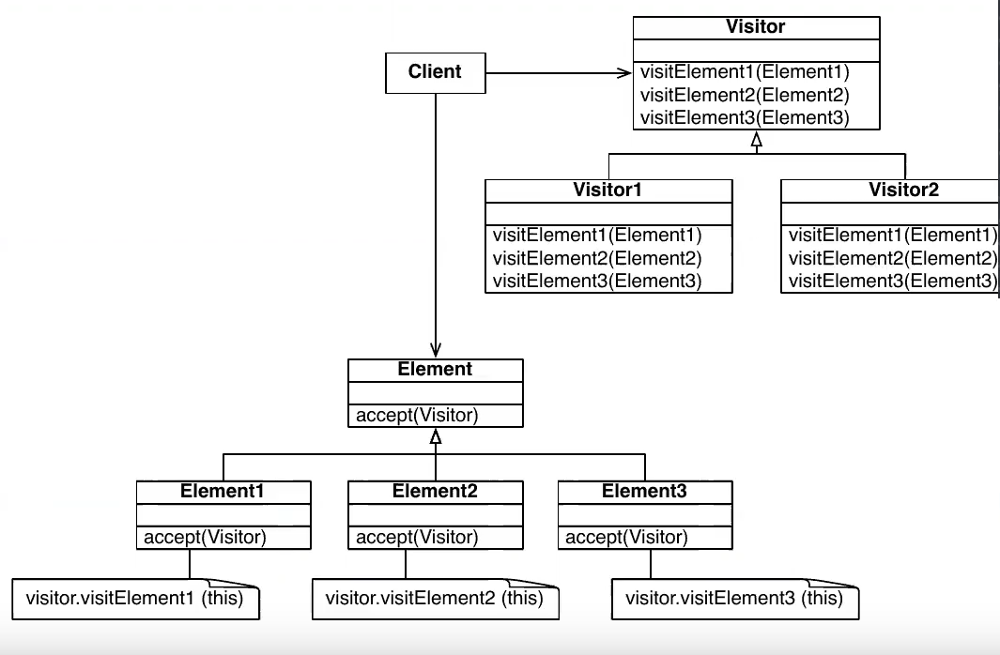
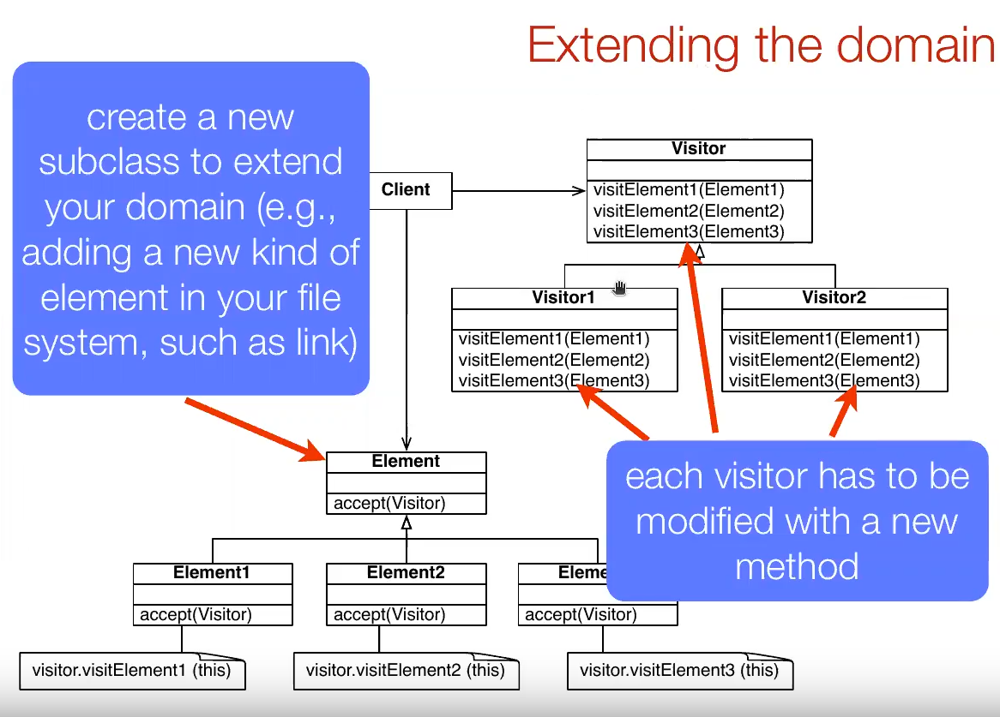

# Visitor Pattern (Patron visitante)

¿Como se acumula informacion de clases heterogeneas?

* Trasladar la tarea de acumulación a un Visitante que pueda visitar cada clase para acumular la información.

**Un visitante es una clase que realiza una operación sobre una estructura de objetos. Las clases que visita un Visitante son heterogéneas. Se hace un uso intensivo de Double Dispatch.**



* Los visitantes (`Visitor1` y `Visitor2`) son operaciones que se deben definir para cada tipo de elemento (`Element1`, `Element2`, `Element3`).
* Ahora los elementos deben implementar el metodo para aceptar los visitantes, es decir, los distintos tipos de operaciones. Como los elementos saben el tipo que son se pasan a si mismo como argumento para la operacion de los visitantes (**Double Dispatch**).
* **Notemos que todos los metodos no retornarán nada, es decir, serán de tipo `void`.**

Sin embargo, notemos que si se agrega otro elemento esto afectará los visitantes pues se deberá modificar la clase para agregar un metodo que realice la operacion sobre este nuevo elemento.



Cualidades de Visitor Pattern:
* Es una buena solucion para agregar nuevas operaciones a bajo costo.
* Las operaciones son definidas externamentes del dominio mediante las subclases de `Visitor`. **Los objetos visitados deben tener setters y getters para obtener sus valores.**
* Uno de los inconvenientes es que suele obligar a que el estado de los objetos sea accesible desde el exterior (setters y getters).

## Visitor Pattern para File System

* El cliente corresponde a `FileSystem`.
* Las clases de elementos serán `AbstractItem`, `Directory` y `*File`.
* Los visitantes reemplazarán las operaciones `getNumberOfFile()`, `getNumberOfDirectory()` y `listing()`.

```java
public class FileSystem {
  private Directory root;

  public FileSystem() {
    root = new Directory();
  }

  public void add(Item item) {
    root.add(item);
  }

  public int getSize() {
    return root.getSize();
  }

  public int getNumberOfFiles() {
    NumberOfFileVisitor v = new NumberOfFileVisitor();
    root.accept(v);
    return v.getResult();
  }

  public int getNumberOfDirectory() {
    NumberOfDirectoryVisitor v = new NumberOfDirectoryVisitor();
    root.accept(v);
    return v.getResult();
  }

  public String listing() {
    ListingVisitor v = new ListingVisitor();
    root.accept(v);
    return v.getResult();
  }
}
```