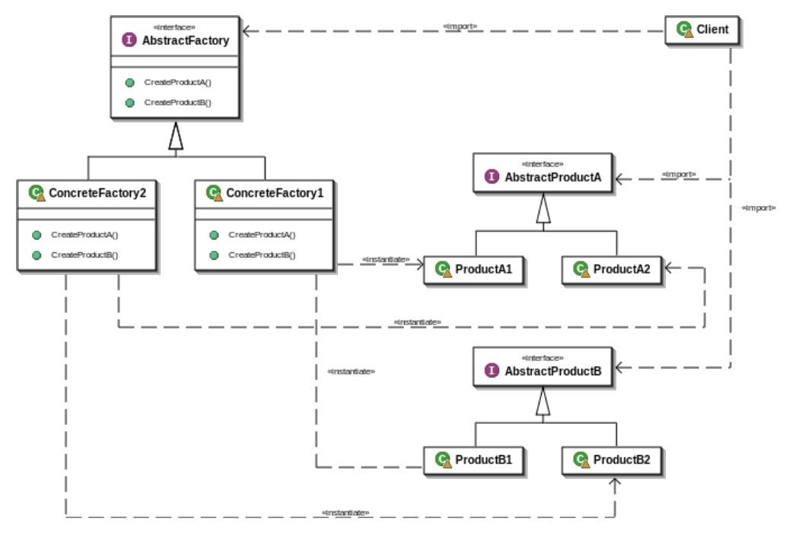
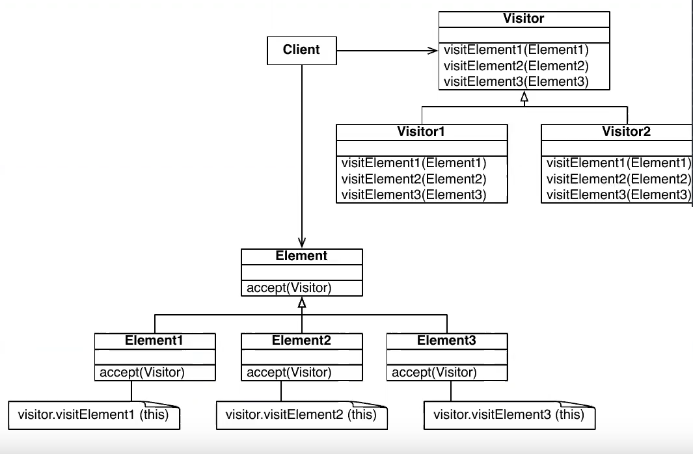

# Patrones de Diseño

* Los patrones de diseño son soluciones a **problemas comunes** de programacion.
* Los patrones de diseño presentan una forma de **estructurar la solucion** a gran escala.
* La implementacion de un mismo patron será distinta para distintos problemas, pero la estructura general será la misma.
* Los Patrones que se verán a continuacion son:
  * **Patrones de Creacion:** Abstract Factory, Factory Method, Singleton.
  * **Patrones Estructurales:** Adapter (Wrapper), Composite, Decorator, Flyweight, Proxy.
  * **Patrones de Comportamiento:** Null Object, Observer, Template Method, Visitor.  

# Adapter Pattern

* Problema:
  * Tenemos que conectar una **aplicacion existente** a un **nuevo servicio**.
* Solucion:
  * Crear una clase intermedia que provee la **interfaz que espera** nuestro programa y que se comunica con el nuevo sistema.
* Consecuencias:
  * **Desacopla** nuestro programa de la implementacion del servicio.
  * Se **ecapsula los cambio** en el servicio haciendo que cualquier cambio en la API afecte unicamente al adapter y no al resto del programa

## Ejemplo
```java
class LegacyRectangle implements Shape {
  public void draw(int x, int y, int w, int h) {
    System.out.println("rectangle at ("+x+','+y+") with width " +w+"and height"+h);
  }
}

class Rectangle implements Shape {
  private LegacyRectangle adaptee = new LegacyRectangle();
  public void draw(int x1, int y1, int x2, int y2)
  {
    adaptee.draw(Math.min(x1, x2), Math.min(y1, y2), Math.abs(x2 - x1),
    Math.abs(y2 - y1));
  }
}
```

# Proxy Pattern

* Problema:
  * Tengo muchos objetos que pueden acceder **directamente** a un servicio.
  * Nos gustaria **tener mas control** sobre como se está manejando ese objeto.
* Solucion:
  * Crear una **clase intermedia que exponga la misma interfaz** que implementa la misma interfaz que el servicio.
* Consecuencia:
  * Podemos teer **tanto cotrol como queramos** sobre como se comunican los clientes con el servicio.
  * Podemos **procesar la informacion que se envia** antes y despues de que pase por el servicio.
  * Las arquitecturas Cliente-Servidor casi siempre utilizan un proxy.

**OBS: Un Proxy difiere de Adapter Pattern en que este no cambia la interfaz de los objetos.**
## UML Proxy Pattern


* la clase `Proxy` tendrá como variable de instancia un objeto de tipo `RealSubject`, pero al instanciarla se declara de tipo `Subject`.

# Driver (No es un patron)

* Problema:
  * Supongamos tenemos un juego que posee muchos objetos y nadie que los maneje.
  * No existe una manera para que el **usuario interactue** con el juego.
* Solucion:
  * Crear un **controlador** que se encargue de **coordinar a los objetos del modelo** y de **recibir instrucciones del usuario**.
* Consecuencias:
  * La clase controladora servirá de **intermediario entre el usuario y el modelo.**
    * El usuario no interactua con el modelo.
    * El modelo no interactua con el usuario.
  * El controlador se encargará de **enviar los mensajes del usuario al objeto indicado** del modelo.
  * Al usuario se le **muestra solamente la informacion relevante** de los cambios en el modelo.
  * El controlador tiene **conocimiento de la estructura del modelo** y por lo tanto puede manejar la informacion del **estado global** del programa.

**OBS: El controlador maneja al modelo, no al reves.**

# Observer Pattern

* Problema:
  * Necesito saber cuando **ocurre algun evento** en especifico sin tener que estar preguntando constantemente para saber su estado.
* Solucion:
  * Hacer que el evento nos **notifique** cuando ocurre.
  * Para poder aprovechar realmente este patron las **notificaciones** deben hacerse de forma **concurrente** a todos los subscriptores que esperan por el evento.
* Consecuencias:
  * Asegura el cumplimiento del principio Open/Closed.
  * Da la capicdad de que se agreguen nuevos suscriptores en tiempo de ejecucion.
  * La concurrencia hace que no se pueda saber el orden en el que se notificarán los eventos.
  * Ineficiente si hay demasiados o si hay observadores que son observados.

## UML Observer Pattern


# State Pattern


* Los estados saber como cambiar/reaccionar.
* Como se observa `Context` tiene una variable de instancia de tipo `State` con la cual sabe el estado, ademas `State` tambien posee una variable de instancia de tipo `Context` para conocer el contexto.
* `Context` maneja el evento, delegando esta responsabilidad a `State`. Cada estado va a saber cuando se produce un cambio de estado o no, enviando un error en el ultimo caso.
* `Context` puede estar en un estado `ConcreteState1` o `ConcreteState2`, alguno de estos dos estados cambiará la variable de instancia `state` de `Context`.
* Es posible agreagar nuevos metodos a la clase `Context`, pero no redefinir los existentes.
* Adicionalmente es posible editar todos los metodos de manejos de eventos `handleEvent()` para que lancen un error por defecto, para que al momento de que los objetos de estados concretos utilicen alguno de estos que no se haya redifinido, pues no lo utiliza, se lance la advertencia.

**OBS: La variante de esta metodologia que utiliza una interfaz en vez de una clase para `State` tambien existe, sin embargo esto puede producir codigo duplicado, pues no necesariamete queremos redefinir o heredar todos los metodos de la clase `State` para las subclases de estados concretos, probablemente solo se necesitará redefinir un par de metodos de los heredados.**

# Template Method Pattern

* Problema: 
  * ¿Como se implementa un algoritmo generico, posponiendo algunas partes a las subclases?
* Solucion:
  * DEfinirlo como un metodo plantilla (Template Method).
* Consecuecias:
  * Conducen a una estructura de control invertida, ya que ua clase padre llama a las operacioes de una subclase y no al reves.
  * Se utiliza en la mayoria de los frameworks para permitir a los programadores de aplicaciones extender facilmente su funcionalidad de las clases del framework.

Un Template Method factoriza la parte comun de algoritmops similares y delega el resto a:
* Metodos gancho (**hook methods**) que las subclases pueden extender.
* Metodos abstractos que las subclases deben implementar.

## UML Template Method


# Composite Pattern

* Problema:
  * ¿Como manejamos una jerarquia de objetos, completa o parte de ella, de una manera consistente?
* Solucion:
  * Definir una interfaz comun que implementen tanto las piezas como los compuestos (**composites**).
* Normalmente, los objetos compuestos (**composite objects**) implementan su comportamiento delegandolo a sus partes que lo componen.

## UML Composite Pattern


* El elemento compuesto `Composite` contiene una lista de elementos `Component` y por lo tanto estos pueden ser de tipo `Leaf` o `Composite`.
* Los metodos `operation()` se redefinen/implementan en las hojas y en los elementos compuestos, donde en este ultimo caso se baja hasta las hojas para realizar la operacion.

# Null Object Pattern

* Problema:
  * ¿Como se puede evitar saturar el codigo de tests de punteros de objetos nulos?
* Solucion:
  * Introduciendo un objeto nulo (**Null Object**) que implementa la interfaz que se espera, pero que no haga nada.
* Consecuecias:
  * Simplifica el codigo del cliente, sobre todo para la parte de testing de punteros nulos. Sin embargo, no vale la pena si solo hay pocos y localizados test para estos punteros.
* **Los objetos nulos tambien pueden ser objetos Singleton, ya que unca necesita mas de una instancia.**

## UML Null Object Pattern


# Factory Pattern

* Problema:
  * ¿Como se puede externalizar la creacion de objetos para asi no preguntar cada vez el tipo de estos?
* Solucion:
  * Se utiliza una clase fabrica que construya las objetos personalizados.

* **Una fabrica crea los objetos sin exponer la instanciacion logica al cliente. Se inicializan los objetos en metodos de la clase fabrica. Toda la carga para inicializar objetos está oculta.**

## UML Factory Pattern


* La fabrica `Factory` retorna productos que cumplen con la interfaz `Product`.

## UML Abstract Factory Pattern



## UML Factory Method Pattern


# Singleton Pattern

* Problema:
  * ¿Como se prohibe mas de una instanciacion para una clase particular?
* Solucion:
  * Un patron singleton (Singleton Pattern) asegura que no se pueda obtener mas de una instanciade una clase.

* **Debe ser utilizado con cuidado porque introduce un estado global.**

# Flyweight Pattern

* Problema:
  * ¿Como se puede dar soporte a un gran numero de objetos individuales de grano-fino (fine-grained) de forma eficiente?
* Solucion:
  * Un patron de peso mosca (**Flyweight Pattern**) permite reutilizar objetos calificados como innecesarios.
  * Un objeto que tiene el mismo estado que otro solo se almacena una vez. De esta manera se compara a nivel de direccion y contenido.

* **La creacion de muchis objetos puede ser la causa de un mal rendimiento de la memoria.**
  * El almacenamiento de objetos de vida corta en una tabla hash permite reutilizarlos facilmente.

## UML Flyweight Pattern


# Visitor Pattern

* Problema:
  * ¿Como se acumula la informacion de clases heterogeneas?
* Solucion:
  * Trasladar la tarea de acumulacion a un visitante (**Visitor**) que pueda visitar cada clase para acumular la informacion.
* Cualidades:
  * Es una buena solucio para agregar uevas operaciones a bajo costo.
  * Las operaciones son definidas externamentes del dominio mediante las subclases de `Visitor`.
  * Un inconveniente es que suele obligar a que el estado de los objetos sea accesible desde el exterior, es decir, se deben agregar metodos setters y getters.

* **Un visitante es una clase que realiza una operacion sobre una estructura de objetos. Las clases que visita un visitante so heterogeneas, por tanto se hace un uso intensivo de Double Dispatch.**
  
## UML Visitor Pattern

